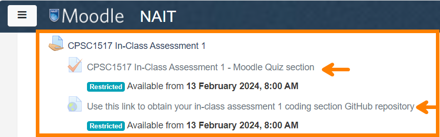

# Agenda

[ Quick Style](./src/008/Docs/Styling.md) instructions for *empty Blazor projects*. 

> These are my notes on what I plan to teach in each [**upcoming class**](#mar-22). For the timeline of where we are today, see [the current schedule](./README.md#schedule).
>
> ##### *... Warn those who are idle ..., encourage the disheartened, help the weak, be patient with everyone.*
>
> > My philosophy of teaching, taken from [the source](https://www.bible.com/bible/111/1TH.5.14.NIV)

----

## Code Samples

Are you interested in grabbing my code samples? Here's a quick script that you can run in the terminal from the root of your own repository to grab all of my code samples and place them inside a folder called `~/dan/`.

```ps
# Ensure your terminal is open at the ROOT of your workbook!
pnpm dlx tiged --disable-cache --force CPSC-1517/cpsc-1517-workbook-jan2024-a01-dgilleland/src ./dan
```

If you *don't* want my samples to be included in your own repository's history, then change the last part from `./dan` to `./rnd`.

Note that each time you run this, it will overwrite the existing content in that folder; that makes it easy to keep up-to-date with my changes. Use your own `~/src/` folder for your personal demos and practices attempts. Detail on how the script works can be found in the [`~/src/ReadMe.md`](./src/ReadMe.md) file.

----

## Jan 9 (W1)

- [x] Course Introduction
- [x] Create student workbook(s)
- [x] Install CLI tools (git, gh, node)
- [x] Install editor (vscode)

## Jan 10

- [ ] Grabbing the Demos (you will need to have Node and [pnpm](https://pnpm.io/installation) installed):
  
    ```ps
    # Ensure your terminal is open at the ROOT of your workbook!
    pnpm dlx tiged --disable-cache --force CPSC-1517/cpsc-1517-workbook-jan2024-a01-dgilleland/src/000 ./src/000
    ```
  
    ```ps
    # Ensure your terminal is open at the ROOT of your workbook!
    pnpm dlx tiged --disable-cache --force CPSC-1517/cpsc-1517-workbook-jan2024-a01-dgilleland/src/001-StartHere ./src/001-StartHere
    ```
  
    ```ps
    # Ensure your terminal is open at the ROOT of your workbook!
    pnpm dlx tiged --disable-cache --force CPSC-1517/cpsc-1517-workbook-jan2024-a01-dgilleland/src/002 ./src/002
    ```

- [ ] Learn some DOS commands?
- [ ] Git & Markdown
  - [000](./src/000/ReadMe.md)
  - Add/Commit/Push - [**The Routine**](./docs/TheRoutine.md)
  - :+1: Student Name in [README.md](README.md)
  - [001- Start Here](./src/001-StartHere/ReadMe.md)
- [ ] Walk through on Projects and Solutions (see Rnd/ReadMe)
- [ ] **Homework!** :100:
  - [002](./src/002/ReadMe.md)
  - Assignments on MS Teams:
    - About Me
    - GitDoc Usage
    - GitDoc Typing Profile
  - Readings:
  - Videos:

## Jan 12

- [ ] Comments/Demo of Practice Assignments
  - About Me
- [ ] Walk through on Projects and Solutions (see [003](./src/003/ReadMe.md))
  - Run the following code

    ```ps
    pnpm dlx tiged --disable-cache --force CPSC-1517/cpsc-1517-workbook-jan2024-a01-dgilleland/src/003 ./src/003
    ```

- [ ] **Homework!**
  - Readings:
    - VS Code [**User Interface**](https://code.visualstudio.com/docs/getstarted/userinterface)
    - [Working with C# in VS Code](https://code.visualstudio.com/docs/languages/csharp)
    - [Working with .NET and VS Code](https://code.visualstudio.com/docs/languages/dotnet)
    - [Getting Started with C# in VS Code](https://code.visualstudio.com/docs/csharp/get-started)
  - Videos:
    - [Intro Videos on C# and VS Code](https://code.visualstudio.com/docs/csharp/introvideos-csharp)

----

## Jan 16 (W2)

- [ ] Comments/Demo of Practice Assignments
  - GitDoc Usage
  - GitDoc Typing Profile
- [ ] Force-commit the `.code-workspace`

    ```ps
    git add ./src/A02-CPSC-1517.code-workspace --force
    git commit -m "Force-add code workspace"
    ```

- [ ] Transition to the [004](./src/004/ReadMe.md) demo and start the intro to TLPs and TDD. Remember to add a workspace folder for 004.

    ```ps
    pnpm dlx tiged --disable-cache --force CPSC-1517/cpsc-1517-workbook-jan2024-a01-dgilleland/src/004 ./src/004
    ```

- [ ] Lot's of Lectures!
  - **What is a Computer Program**
    - *A computer program is a **set of instructions** for manipulating **information**.*
    - Information: Primitve Types & Complex Types
      - Primitive types: Textual, Numeric, Conceptual
      - Complex types: Classes (`class`), `struct`, `record`
        - A class is a blueprint for creating objects.
        - It describes what an object will *look like* and how it will *behave*.
        - `class` is made up of fields, properties, methods and constructors.
    - Kinds of programs:
      - CLI (console w. UI)
      - Desktop
      - Web
      - Others: (scheduled jobs, server apps, edge applications, etc.)
- [ ] **Homework!**
  - My TLP tutorials

## Jan 17

- [ ] Jump-start **004** demo (discuss the code they have)
  - [ ] version 1 - with unit tests and simple primitive class members

## Jan 19

> "7H3 M345UR3 OF 1N73LL163NC3 15 7H3 481L17Y 70 CH4N63" - 4l83r7 31n5731n

- [ ] Discuss the Take-Home Lab Exercises
- [ ] Resume **WindChill** demo
- [ ] **Homework!**
  - [ ] In VS Code: *Help -> Welcome*, then follow the "Get Started with C# DevKit"
  - [ ] Review the [Simplified C# Grammar](https://programming-0101.github.io/TheBook/Teach/chapter1-7.html)

----

## Jan 23 (W3)

- [ ] Discuss the Take-Home Lab Exercises
  - [ ] Ex 1 - Unit Tests & Utilities class
- [ ] C# Review Presentations
    - [ ] [Foundational Concepts](https://programming-0101.github.io/slides/OOP-Ramp-Up/00-FoundationalConcepts.html)
  - [ ] [Enums](https://programming-0101.github.io/slides/OOP-Ramp-Up/02-Enum.html)
- [ ] **Homework!**
  - [ ] Check out these presentations on your own...
    - [ ] [Grammar](https://programming-0101.github.io/slides/OOP-Ramp-Up/01-Grammar.html)

## Jan 24

- [ ] C# Review Presentations
  - [ ] [Simple Objects](https://programming-0101.github.io/slides/OOP-Ramp-Up/03-Objects.html)
  - [ ] [Object Inheritance](https://programming-0101.github.io/slides/OOP-Ramp-Up/04-Objects.html)

## Jan 26

- [ ] Resume [**WindChill**](./src/004) demo
  - [ ] version 1 - with unit tests and simple primitive class members
- [ ] **Tip:** *Don't force abstractions by rushing to create complex data types. Begin with classes/records that have intrinsic primitive types.*

----

## Jan 30 (W4)

- [ ] Resume Assorted Demos

    ```ps
    pnpm dlx tiged --disable-cache --force CPSC-1517/cpsc-1517-workbook-jan2024-a01-dgilleland/src/005 ./src/005
    ```

----

## Feb 9

- [ ] Comments on Quiz 1
- [ ] Blazor Web Application Intro

    ```ps
    pnpm dlx tiged --disable-cache --force CPSC-1517/cpsc-1517-workbook-jan2024-a01-dgilleland/src/006 ./src/006
    ```

- [ ] **Homework!**
  - [ ] Read the following:
    - [ ] [**ASP.NET Documentation**](https://learn.microsoft.com/en-us/aspnet/core/?view=aspnetcore-8.0) *(Entry point to learn more about ASP.NET)*
    - [ ] [**ASP.NET Core Blazor**](https://learn.microsoft.com/en-us/aspnet/core/blazor/?view=aspnetcore-8.0)
    - [ ] [**ASP.NET Core Blazor project structure**](https://learn.microsoft.com/en-us/aspnet/core/blazor/project-structure?view=aspnetcore-8.0)
    - [ ] [**Layout in ASP.NET Core**](https://learn.microsoft.com/en-us/aspnet/core/mvc/views/layout?view=aspnetcore-8.0)
    - [ ] [**Razor syntax reference for ASP.NET Core**](https://learn.microsoft.com/en-us/aspnet/core/mvc/views/razor?view=aspnetcore-8.0)
    - [ ] [**ASP.NET Core Razor components**](https://learn.microsoft.com/en-us/aspnet/core/blazor/components/?view=aspnetcore-8.0)
    - [ ] [**ASP.NET Core Razor component lifecycle**](https://learn.microsoft.com/en-us/aspnet/core/blazor/components/lifecycle?view=aspnetcore-8.0)

----

## Extra Resources

- [ ] [Learn C# through Console Games](https://dev.to/zacharypatten/learn-c-through-console-games-49kk) and [**More C# Console Games**](https://dev.to/zacharypatten/more-c-console-games-27bg)

## Feb 13 (W6)

- [ ] Exercise 2 Solution


## Feb 14

- [ ] **Quiz 1**

  

## Feb 16

- [ ] Classless CSS in Blazor 8

    ```ps
    pnpm dlx tiged --disable-cache --force CPSC-1517/cpsc-1517-workbook-jan2024-a01-dgilleland/src/007 ./src/007
    ```

- [ ] **Homework!**
  - [ ] Read the following (along with readings added to [*Feb 9*](#feb-9)):
    - [ ] [**ASP.NET Core Blazor project structure**](https://learn.microsoft.com/en-us/aspnet/core/blazor/project-structure?view=aspnetcore-8.0)
    - [ ] [ASP.NET Core Blazor forms overview](https://learn.microsoft.com/en-us/aspnet/core/blazor/forms/?view=aspnetcore-8.0)
    - [ ] [ASP.NET Core Blazor input components](https://learn.microsoft.com/en-us/aspnet/core/blazor/forms/input-components?view=aspnetcore-8.0)
    - [ ] [ASP.NET Core Blazor forms binding](https://learn.microsoft.com/en-us/aspnet/core/blazor/forms/binding?view=aspnetcore-8.0)
    - [ ] [ASP.NET Core Blazor forms validation](https://learn.microsoft.com/en-us/aspnet/core/blazor/forms/validation?view=aspnetcore-8.0)
    - [ ] [Working with Dates And Times in Razor Pages Forms](https://www.mikesdotnetting.com/article/352/working-with-dates-and-times-in-razor-pages-forms)
    - [ ] [Troubleshoot ASP.NET Core Blazor forms](https://learn.microsoft.com/en-us/aspnet/core/blazor/forms/troubleshoot?view=aspnetcore-8.0)
    - [ ] [Model Binding in ASP.NET Core](https://learn.microsoft.com/en-us/aspnet/core/mvc/models/model-binding?view=aspnetcore-8.0)
    - [ ] [Work with images in ASP.NET Core Blazor](https://learn.microsoft.com/en-us/aspnet/core/blazor/images?view=aspnetcore-8.0)
    - [ ] [ASP.NET Core Blazor QuickGrid component](https://learn.microsoft.com/en-us/aspnet/core/blazor/components/quickgrid?view=aspnetcore-8.0)

----

## Reading Break

| Feb 12-16, 2024 | Showing Appreciation |
|:--:|:---|
|  | What takes you 5 minutes to read may take 40 minutes to write with additional background time spent researching and verifying the content. Take time to appreciate that what you are consuming in such a short time has taken exponentially more time to produce. Share the appreciation for what you receive. |

----

## Feb 27

> Instructor away - students are to ensure they have completed the [readings from Feb 15](#feb-15).


## Feb 28

- [ ] Solution to the In-Class Assessment


## Mar 1

- [ ] HTML Form Elements (In Blazor 8)

    ```ps
    pnpm dlx tiged --disable-cache --force CPSC-1517/cpsc-1517-workbook-jan2024-a01-dgilleland/src/008 ./src/008
    ```

  - [ ] Run the website in watch mode

    ```ps
    cd src/008/Website
    dotnet watch
    ```

----

## Mar 5

- [ ] Blazor Input Controls for Forms
  - [ ] Present updates to the [008](./src/008/ReadMe.md) resources/demo
  - [ ] Discuss the [Common Controls](https://learn.microsoft.com/en-us/aspnet/core/blazor/forms/input-components?view=aspnetcore-8.0#input-components) for Blazor forms and the use of the `<EditForm>` Component.
- [ ] Reports and CSV Data
  - [ ] Begin the *Weather-or-Not* demo

    ```ps
    pnpm dlx tiged --disable-cache --force CPSC-1517/cpsc-1517-workbook-jan2024-a01-dgilleland/src/009 ./src/009
    ```

  - [ ] Plan/Design the App

## Mar 6

- [ ] Review Specs on Exercise 3
- [ ] Continue with 009 (Weather App)

----

## Mar 19

- [ ] Quiz 2 Prep

    ```ps
    pnpm dlx tiged --disable-cache --force CPSC-1517/cpsc-1517-workbook-jan2024-a01-dgilleland/src/Q2-Prep ./src/Q2-Prep
    ```

## Mar 20

- [x] Quiz 2

## Mar 22

- [ ] Databases and Blazor using **WestWind** (see [`~/src/011`](./src/011/ReadMe.md))

    ```ps
    pnpm dlx tiged --disable-cache --force CPSC-1517/cpsc-1517-workbook-jan2024-a01-dgilleland/src/011 ./src/011
    ```

----

## Mar 26

> Follow the [**Step-by-Step Instructions**](./src/011/StepByStep/ReadMe.md).

- [ ] Continue Developing the WestWind Demo ([`~/src/011`](./src/011/ReadMe.md))
  - [ ] **Business-Logic-Layer** - `ProductServices` class
  - [ ] **Dependency-Injection** - `WestWindServices` class
  - [ ] **Configuring Services** - `Program` class
- [ ] Readings:
  - [ ] [Lambdas and Delegates](https://dmit-2018.github.io/topics/linq/lambda.html)

## Mar 27

- [ ] Continue Developing the WestWind Demo ([`~/src/011`](./src/011/ReadMe.md))
  - [ ] Product Catalog page
  - [ ] Product Editing page

## Mar 29

- [ ] ***[Self-study]*** - Continue Developing the WestWind Demo ([`~/src/011`](./src/011/ReadMe.md))
  - [ ] Complete any remaining demo work for Products CRUD
  - [ ] Practice by creating CRUD services/pages for **Suppliers**
  - [ ] Practice by creating CRUD services/pages for **Categories**

----

## *Future - TBD*

> ***TODO:** Consolodate these ideas with the other section (Beyond Compare)*

- [ ] Demo **Fraction**
  - [ ] version 1 - create unit tests
- [ ] Resume **WindChill** demo
  - [ ] version 2 - 
- [ ] Resume **WindChill** demo
  - [ ] version 3 - 
- [ ] C# Review Presentations
  - [ ] [Arrays](https://programming-0101.github.io/slides/OOP-Ramp-Up/05-Arrays.html)
  - [ ] [Interfaces](https://programming-0101.github.io/slides/OOP-Ramp-Up/08-Interface.html)
  - [ ] [EF Core](https://programming-0101.github.io/slides/OOP-Ramp-Up/15-EF-Core.html)
  - [ ] [~~Unit Tests~~](https://programming-0101.github.io/slides/UnitTests/index.html)
