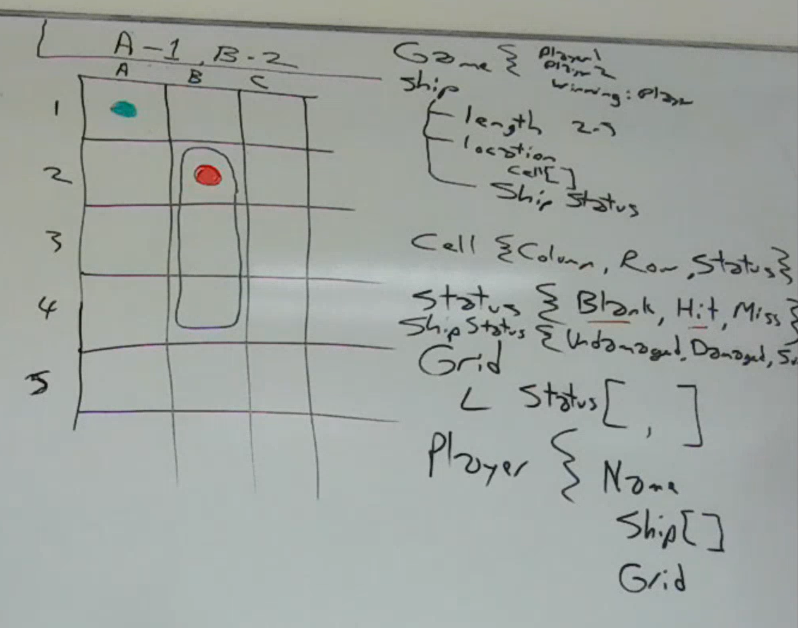

# Ship Battles

> An ad-hoc knock-off for quick-cash.

## Playing

> ***Note:** Helpful for manual testing.*

The game can be played in the console using the [`Console.Game` program](./Console.Game/Program.cs).

## Design

### Randomness

Randomness is needed in the game in terms of ...

----

## Appendix

### Nice Utility Types

This demo includes a few nice utility types which saves on a lot of common validation from being spread throughout your codebase.

#### `EnumParser`

Parsing enumerations from strings or integers involves a bit of repetitive code. It can all be simplified through the use of a static class with static methods. Hence, the [`EnumParser`](./Game/EnumParser.cs) utility class.

#### `TrimmedText`

Often, when we need strings, we wind up requiring that the text be non-null/non-empty and that it be properly trimmed. This is a *very common* issue throughout a code base. The [`TrimmedText`](./Game/TrimmedText.cs) type is a very short and nice substitute for the `string` data type, while still allowing it to "play nice" with literal string values and with text I/O.

#### NaturalInt

This class represents whole numbers greater than zero (often referred to as *Natural numbers* - see the [comments under the Research Notes below](#natural-numbers-and-zero)).

----

### Research Notes

#### Natural Numbers and Zero

I did a search on Bing, and here's a nice AI response that I found informative:

> There is no definitive answer to whether zero is a natural number or not. Different sources and conventions may have different definitions of natural numbers. Some include zero, while others exclude it. Here are some examples of different conventions:
>
> - According to the **ISO 80000-2** standard, the natural numbers are the set of non-negative integers {0, 1, 2, ...}¹.
> - According to some **mathematicians** and **textbooks**, the natural numbers are the set of positive integers {1, 2, 3, ...}²³⁵.
> - According to some **computer scientists** and **programmers**, the natural numbers are the set of non-negative integers {0, 1, 2, ...}, and they are sometimes denoted by ℕ₀ to distinguish them from the positive integers, which are denoted by ℕ⁴.
>
> The choice of whether to include zero or not depends on the context and the purpose of the definition. There are advantages and disadvantages to both options. For example, including zero makes the natural numbers a **ring**, which is a useful algebraic structure, but excluding zero makes the natural numbers a **well-ordered set**, which is a useful logical property. Ultimately, the most important thing is to be clear and consistent about the definition being used.
>
> Source: Conversation with Bing, 2024-02-09
>
> (1) Natural number - Wikipedia. https://en.wikipedia.org/wiki/Natural_number.
>
> (2) Is $0$ a natural number? - Mathematics Stack Exchange. https://math.stackexchange.com/questions/283/is-0-a-natural-number.
>
> (3) Is 0 a Natural Number? - GeeksforGeeks. https://www.geeksforgeeks.org/is-0-a-natural-number/.
>
> (4) Why Zero Is Not a Natural Number - Medium. https://cacilhas.medium.com/why-zero-is-not-a-natural-number-bdcff401a98d.
>
> (5) Is 0 a Natural Number - A Beginner’s Guide - The Story of Mathematics. https://www.storyofmathematics.com/is-0-a-natural-number/.
