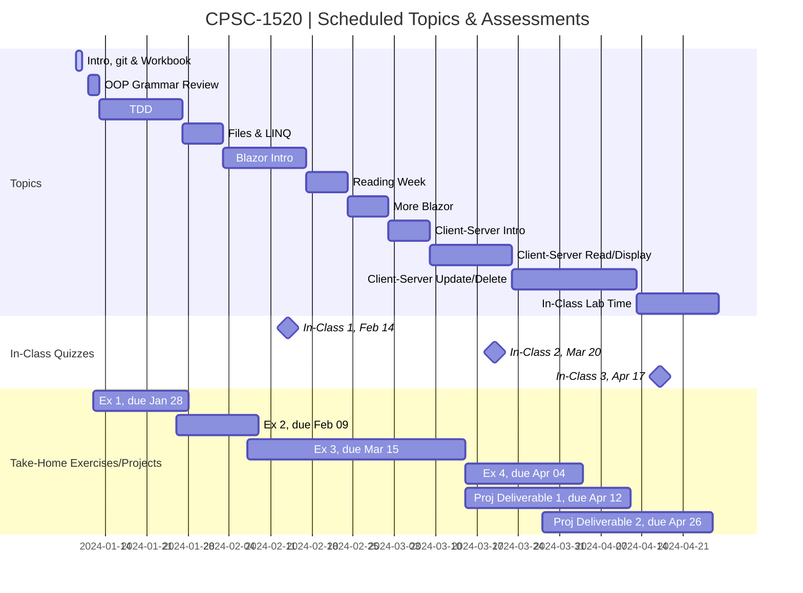

# CPSC-1517 - **Student Workbook** (Jan 2024)

> **STUDENT_NAME**

## Schedule

> The following schedule is subject to change. Consult the course outline for the mark distribution. See the [Agenda](./Agenda.md) for details on upcoming and completed topics.

----

##  Inside this repository

This repository is your **Student Workbook** for participating in the in-class demos and for completing practice homework; the coding work is to be placed in the [*`src/`*](./src/ReadMe.md) folder. Learning Outcomes ([**LOGs**](./docs/learning_outcomes/ReadMe.md)) and other useful notes can be found in the [**docs** folder](./docs). Also, you are encouraged to use the [**docs/mynotes**](./docs/mynotes/ReadMe.md) folder to record your notes from each class.

> :warning: **Do *NOT*** use this repository for any assignments that are worth marks. :warning:

Additionally, you can find online notes at the course's [Moodle site](https://moodle.nait.ca).

<!--
> *There are old,  unofficial [website notes](https://cpsc-1517.github.io). These notes are no longer maintained, but may still be useful for some aspects of this course. You should remember that they contain content that references the older .NET Framework which is no longer taught in this course, so don't attempt to blindly apply content into material for the current iteration of this course.*
-->

----

##  Version Control

At the end of the term, your repositories on the [CPSC-1517 GitHub Organization](https://github.com/CPSC-1517) will be removed. You will still have access to your local versions of these repositories for your personal use and review.

> :warning: **Do *NOT*** re-publish your assignment/assessment repositories - doing so with any materials worth marks is an act of academic dishonesty :warning:

----

##  Software & Resources

Required tools for this course include:

- **.NET SDKs**
  - You should be prepared to have the appropriate versions of .NET Core SDKs (*Software Development Kit*) installed on your computer. You can find the latest versions at [dot.net](https://dot.net).
- **Command-Line Tools**
  - [**Git** for Windows/macOS/Linux](https://git-scm.com/downloads)
  - [**GitHub CLI**](https://cli.github.com/)
  - [**node**](https://nodejs.org/en/download/) (which includes **npm**) - Node is a run-time that allows you to use JavaScript on the web server. It comes along with npm (*Node Package Manager*), a package-management tool for the command line that allows you to integrate 3rd-party libraries with your application.
- **Visual Studio** - *Your Instructor may have a preference for which IDE you use.*
  - [Visual Studio Code](https://code.visualstudio.com) (see [Notes](./docs/ToolTips.md#vs-code) on VS Code extensions)
  - [Visual Studio 2022, Community Edition](https://visualstudio.microsoft.com/) (see [Notes](./docs/ToolTips.md#vs-2022-community) on the minimum version)
- [**LinqPad 8**](https://www.linqpad.net/Download.aspx) or higher
- **Database Tools**
  - [SQL Server 2022](https://www.microsoft.com/sql-server/sql-server-downloads) or higher, **Developer Edition**
    - If you are installing SQL Server on a Mac, follow the instructions in this article:
      - [How to Install SQL Server on a Mac](https://database.guide/how-to-install-sql-server-on-a-mac/)
    - You might also find this video useful:
      - [Step By Step Guide To Install MSSQL Server On Mac Using Docker](https://youtu.be/BVNWRYPv78o) (20 min, 27 sec)
  - Database Management Tools - *For a comparison, see these tables of [feture comparisons](https://learn.microsoft.com/en-us/azure-data-studio/what-is-azure-data-studio#feature-comparison-with-sql-server-management-studio-ssms).*
    - [SQL Server Management Studio](https://docs.microsoft.com/sql/ssms/download-sql-server-management-studio-ssms?view=sql-server-ver15#download-ssms) (*SSMS*)

Additional recommended tools for this course include:

- **Version Control**
  - [GitHub CLI](https://cli.github.com/) (*Command-Line Interface*)
- **Drawing Tools**
  - A [LucidChart](https://www.lucidchart.com/pages/) free account, or Draw.io ([desktop](https://about.draw.io/integrations/#integrations_offline) and [online](https://draw.io) versions)
  - [Balsamiq Desktop](https://balsamiq.com/wireframes/desktop/) for mockups (*This is a commercial application*)

Other recommended resources include:

- [Learn Markdown](https://commonmark.org/help/)
- [Programming Fundamentals - An Object-Oriented Introduction to Programming in C#](https://programming-0101.github.io/TheBook/)

