# Know Your Tools 

> At the core, you really, really need to know how to install software on your computer. If you are struggling with basics such as [**how to install software**](https://www.computerhope.com/issues/ch000561.htm), then you had better master the subject - and *fast!* If you can't (or *won't*) learn how to do this *on your own*, then (I know this sounds harsh) you should consider a different career than Information Technology!

> Here are some quick notes on the tools commonly used in this course.

- **VS Code** (*Preferred*)
  - Review the notes on using the [SQL Server extension for Visual Studio Code](https://docs.microsoft.com/en-us/sql/tools/visual-studio-code/sql-server-develop-use-vscode?view=sql-server-ver16)
  - Review the notes on using the [GitDoc extension](https://github.com/lostintangent/gitdoc#gitdoc-). Also review these instructions on how to turn on [AutoSave in VS Code](https://neutrondev.com/vs-code-auto-save/).

----

----

### VS Code

- Begin your journey with VS Code with these [introductory videos](https://code.visualstudio.com/docs/introvideos/overview).
- Required Extensions:
  - [C# Dev Kit](https://marketplace.visualstudio.com/items?itemName=ms-dotnettools.csdevkit)

----

### VS 2022 Community

[**Visual Studio 2022**](https://visualstudio.microsoft.com/) comes with full support for the .NET Core platform. If you need to upgrade, launch the Visual Studio Installer and upgrade through that tool.

| 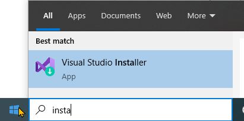 | 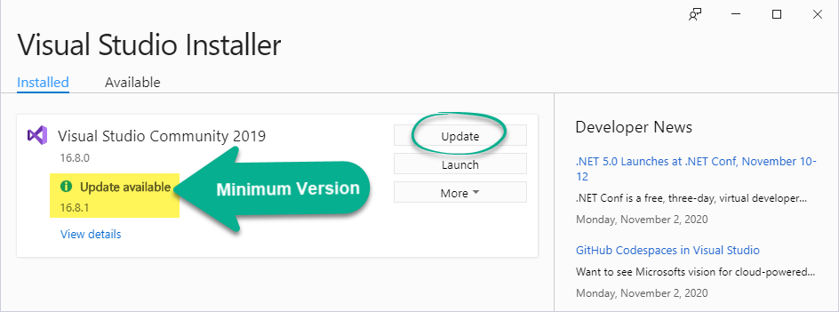 |
|--------------------------------------------------------|----------------------------------------------------------------------|
| Lauch the VS Installer | Install any updates (*note: the image above is outdated*) |

You also should ensure you have the required workflows and components for this course. *(Note: some images below may be outdated.)*

| Required Workflows | Recommended Workflows | Individual Components | Extensions |
|--------------------|-----------------------|-----------------------|------------|
| 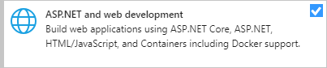 | 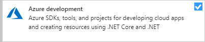 | 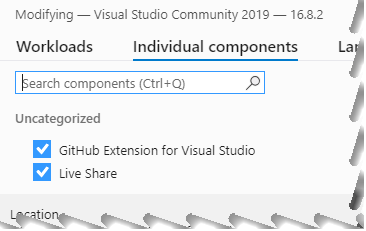 | 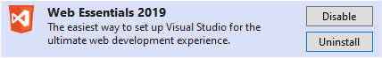 |
| 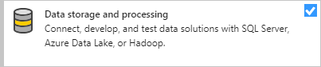 | 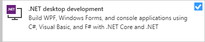 | | 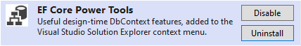 |
| | 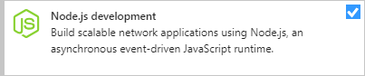 | | |
| | 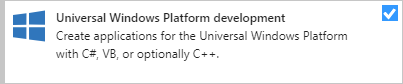 | | |
| | 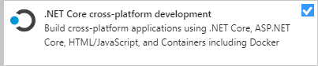 | | |

----

## Other Helpful Tools

- **Azure Data Studio**
  - [Azure Data Studio](https://docs.microsoft.com/sql/azure-data-studio/download-azure-data-studio?view=sql-server-ver15) (*ADS*)
  - Read this article on [Digging Deeper into Azure Data Studio Extensions](https://www.sqlshack.com/digging-deeper-into-azure-data-studio-extensions-and-azure-sql-db-development/)
