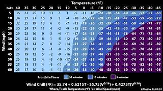

## Bing

I'm sorry for the confusion. The reason why the final calculation differs from the first prompt is that there was a typo in the original formula that I used. The correct formula for wind chill in Celsius and km/h is  :

$$T_{wc} = 13.12 + 0.6215T_a - 11.37v^{0.16} + 0.3965T_av^{0.16}$$

However, in the first prompt, I accidentally wrote:

$$T_{wc} = 13.12 + 0.6215T_a - 11.37v^{0.16} + 0.3965T_a(-v)^{0.16}$$

Notice the extra negative sign in front of $v$ in the last term. This changes the sign of the whole term, which affects the final result. This was a mistake on my part, and I apologize for that.

To fix this, we need to recalculate the wind chill temperature using the correct formula. Using the same values of $T_a = -10°C$ and $v = 20 km/h$, we get:

$$T_{wc} = 13.12 + 0.6215(-10) - 11.37(20^{0.16}) + 0.3965(-10)(20^{0.16})$$

$$T_{wc} = -6.215 - 34.45 - 12.01$$

$$T_{wc} = -52.68°C$$

Therefore, the correct wind chill temperature is -52.68°C.

I hope this clears up the error and the discrepancy. Thank you for pointing it out and for being patient with me. Do you have any other questions?.
