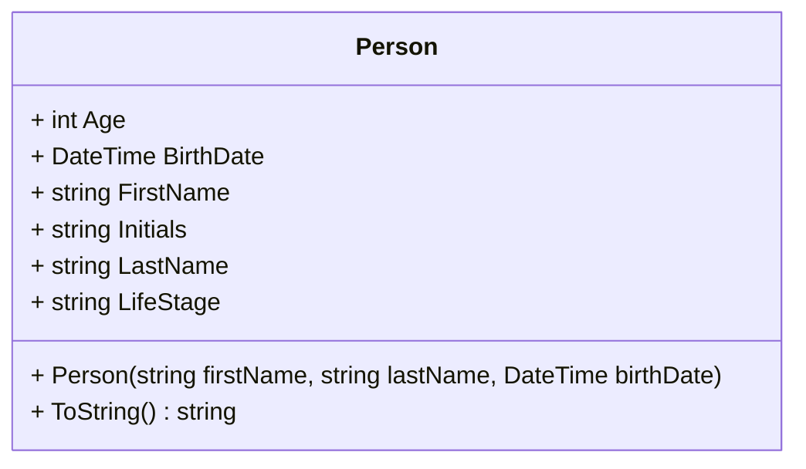

# Class Diagrams

A **Class Diagram** is basically just a picture of the structure of a class in Object-Oriented Programming (OOP). A class diagram can consist of one or more *classes*.

> *A **class** is a blueprint for creating **objects**. The blueprint describes what an object **looks like** (its fields/properties) and how it **behaves** (its constructors and methods).*

You can create a diagram of a class by drawing a box with three compartments stacked on top of each other.

- The top-most compartment is the *class name*. It may also include some *annotations* describing some characteristic of the class.
- The middle compartment contains a list of the *data items* stored in the object. At a minimum, the data's *data type* and *name* are represented for each item. We refer to the notion of a class or object containing other discrete pieces of data as **composition**.
- The bottom compartment contains a list of the *constructors* and *methods* that represent the *behaviour* of the object.

Here's a simple class diagram that was generated by Visual Studio off of a class that has already been coded.

Besides using images like the one above, we can use *mermaid syntax* to create [class diagrams](https://mermaid.js.org/syntax/classDiagram.html). Here's the mermaid version of the same class.

> Note that the two diagrams have slightly different representations of the structure of the class. A class diagram is not necessarily a one-to-one representation of the structural details of the class; this is due in part to the various ways different programming languages implement classes. For example, while C# has the concept of "properties", the Java language implements these as simple methods known as "getters" and "setters". Additionally, programming languages are constantly evolving with new features/capabilities.

