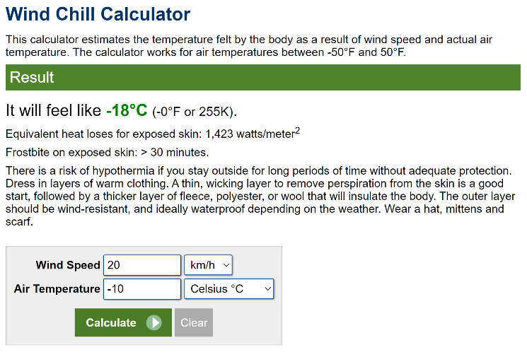

# Intro to Test-Driven Development

**Test-Driven Development** (*TDD*) is one of the best practices for building software applications. As we work to complete our application, we will make use of TDD practices to guide our application's internal functionality. For this, we will need to have another project as part of our solution: An **XUnit** project.

## Setup

Using the terminal, run the following from inside the `~/src/004` folder.

```ps
dotnet new xunit -o WindChill.Specs -n WindChill.Specs
```

Then, let's add that to our solution.

```ps
dotnet sln add WindChill.Specs/WindChill.Specs.csproj
```

Now, change directory to the testing folder and add in a reference to our WindChill application and a package for a library called `FluentAssertions`.

```ps
cd WindChill.Specs
dotnet add reference ../WindChill/WindChill.csproj
dotnet add package FluentAssertions
```

Open the `GlobalUsings.cs` and modify the code so that it reads as follows.

```cs
global using Xunit;
global using FluentAssertions;
```

## Testing for WindChill

In the [previous document](./ReadMe.md), we started embarking on the task of creating a class to calculate the wind chill temperature.

> $$T_{wc} = 13.12 + 0.6215 \times T_a - 11.37 \times V^{0.16} + 0.3965 \times T_a \times V^{0.16}$$
> 
> Where:
> 
> - $T_{wc}$ is the wind chill in degrees celsius
> - $T_a$ is the air temperature in degrees celsius
> - $V$ is the wind speed in kilometers per hour

Let's create a bit of test data to help us check that our math is correct. We'll use the info we gathered from our [Bing AI search results](./ReadMe.md#calculating-the-wind-chill).

> *Grab your calculator and make sure my math is correct here!*

| Air Temp (°C) | Wind Speed (km/h) | Wind Chill |
| :--: | :--: | :--: |
| -10 | 20 | -18.76 |

So far, that looks good. But let's check against an [online wind chill calculator](https://goodcalculators.com/wind-chill-calculator/) (chosen at random).

### ¡AI, Chihuahua!

[¡Ay, Chihuahua!](https://www.tellmeinspanish.com/vocab/ay-chihuahua/) - What went wrong?! Our Bing AI formula said the temperature should be `-18.76`, but the online calculator says it should be `-17.84`.


Is that right?! Let's try [another calculator](https://www.calculator.net/wind-chill-calculator.html?windspeed=20&windspeedunit=kmh&airtemperature=-10&airtemperatureunit=celsius&x=Calculate).



Now it's a different result. But all three values are kinda close. It's time to do some [research](https://sciencing.com/calculate-wind-chill-factor-5981683.html). Take a moment and review the article from [Sciencing.com](https://sciencing.com/calculate-wind-chill-factor-5981683.html), then come back to this lesson.

It turns out, the first online calculator had a mistake in its formula!

$$
WC (Wind Chill, °F) = 35.74 + 0.6215 × T - 35.75 × V 0.16 + 0.4275 × T × V 0.16
$$

Let that be a lesson to you! It's important to do some ***research*** and to check with reputable sources, rather than just grab the first thing that you think is right. AI is getting better, but it's still a *new* technology, and it can get some things wrong (like Math or basic facts).

### The `WindChill` Class

Parsing the arguments for our wind chill calculations is a little more involved. We could do it inside our TLP, but since the arguments are highly specific to the wind chill calculations, let's just hand-over the arguments to the `WindChill` class through a constructor to let it do the parsing and the construction of the object.

----

## Appendix

### `WindChill_Should.cs`

Here's the complete code for the `WindChill_Should` class.

```cs
```

### `WindChill.cs`

Here's the complete code for the `WindChill` class.

```cs
```


----

----

# TEMP

```cs
// Using statements must be at the top of the file
using System;
using static System.Console; // so we can use Console.WriteLine() as WriteLine()

// The body of the Main method is the next item in the file
WriteLine("Hello Wind Chill!");
// TODO: Add code to parse the arguments and calculate the wind chill
// For now, we'll just exit with a code of 0
return 0;

// Members of the class (fields, properties, and methods) are to be placed after the body of the Main method
// Fields
public static const double FreezingPointCelsius = 0.0;
private static double _TemperatureCelcius;
private static double _WindSpeedKmH;

public static double WindChill { get; private set; }
public static char Units { get; private set; } // 'F' or 'C'

// Methods
public static double ConvertToFarhenheit(double temperatureCelcius)
{
    return temperatureCelcius * 9 / 5 + 32;
}
public static double ConvertToCelsius(double temperatureFahrenheit)
{
    return (temperatureFahrenheit - 32) * 5 / 9;
}
public static double ConvertToMilesPerHour(double windSpeedKmH)
{
    return windSpeedKmH / 1.609344;
}
public static void CalculateWindChill()
{
    // Based on fields/properties, this will set the WindChill property
    // Assuming that _TemperatureCelcius and _WindSpeedKmH have been set
    // first, calculating the results in Celsius
    double windChillCelsius = 13.12 + 0.6215 * _TemperatureCelcius - 11.37 * Math.Pow(_WindSpeedKmH, 0.16) + 0.3965 * _TemperatureCelcius * Math.Pow(_WindSpeedKmH, 0.16);
    // Adjust the wind chill based on the units
    if (Units == 'F')
    {
        WindChill = ConvertToFarhenheit(windChillCelsius);
    }
    else
    {
        WindChill = windChillCelsius;
    }
}
    WriteLine($"Temperature: {args[0]}°C");
    WriteLine($"Wind Speed: {args[1]} km/h");


public static void ShowHelp()
{
    WriteLine("This is a CLI to calculate wind chill.");
    WriteLine("Usage: dotnet run -- <temperature> <wind speed> <options>");
    WriteLine();
    WriteLine("Arguments:");
    WriteLine("  <temperature>\tAir Temperature (in Celsius by default)");
    WriteLine("  <wind speed>\tWind Speed (in km/h by default)");
    WriteLine();
    WriteLine("Options:");
    WriteLine("  --help\tShow this help message");
    WriteLine("  -f\t\tTemperature is in Fahrenheit");
    WriteLine("  -m\t\tWind speed is in m/h");
}
```

----
