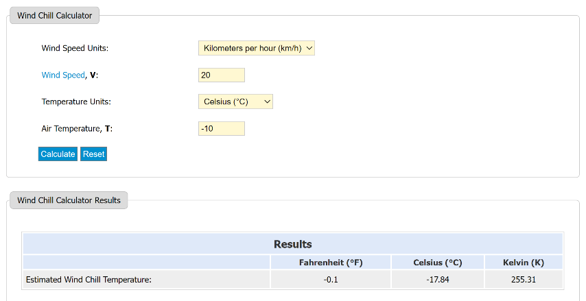
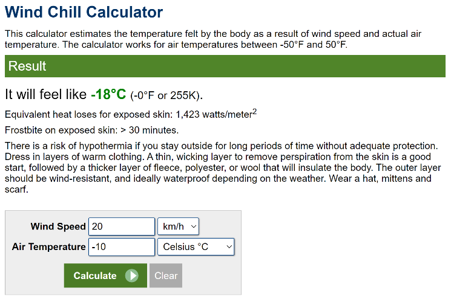

# Calculating Wind Chill

I went through a bit of work looking into how to calculate wind chill. Of course, this being Jan 2024, I decided to start by going straight to AI. And, being cheap, I went with the built-in AI from the Bing search engine. Usually, that's not much of a problem. This time....

----

## My Bing Search

According to [Bing](#wind-chill-formula-from-bing-chat) the formula for wind chill is as follows:

> $$T_{wc} = 13.12 + 0.6215 \times T_a - 11.37 \times V^{0.16} + 0.3965 \times T_a \times V^{0.16}$$
>
> Where:
>
> - $T_{wc}$ is the wind chill in degrees celsius
> - $T_a$ is the air temperature in degrees celsius
> - $V$ is the wind speed in kilometers per hour
>
> For example, if the air temperature is -10°C and the wind speed is 20 km/h, the wind chill is:
>
> $$T_{wc} = 13.12 + 0.6215 \times (-10) - 11.37 \times 20^{0.16} + 0.3965 \times (-10) \times 20^{0.16}$$
>
> $$T_{wc} = -18.76 \text{°C}$$

I took that data and then started creating a table of test data that I could use to check my program.

| Air Temp (°C) | Wind Speed (km/h) | Wind Chill |
| :--: | :--: | :--: |
| -10 | 20 | -18.76 |

Next, I went to an [online calculator for the wind chill](https://goodcalculators.com/wind-chill-calculator/) so that I could create some more test data. That's when I tried the same input Bing suggested and saw a *different* result!

### ¡AI, Chihuahua!

[¡Ay, Chihuahua!](https://www.tellmeinspanish.com/vocab/ay-chihuahua/) - What went wrong?! Our Bing AI formula said the temperature should be `-18.76`, but the online calculator says it should be `-17.84`.

Is that right?! Let's try [another calculator](https://www.calculator.net/wind-chill-calculator.html?windspeed=20&windspeedunit=kmh&airtemperature=-10&airtemperatureunit=celsius&x=Calculate).

Now it's a different result. But all three values are kinda close. It's time to do some [research](https://sciencing.com/calculate-wind-chill-factor-5981683.html). Take a moment and review the article from [Sciencing.com](https://sciencing.com/calculate-wind-chill-factor-5981683.html), then come back to this article.

### The Wind Chill Formula

After some searching, I decided to use the formulas from [Sciencing.com](https://sciencing.com/calculate-wind-chill-factor-5981683.html) (partly because they bothered to put together the formulas using both American and Canadian units of measurement).

> Wind chill formula in English units of measurement:
>
> Wind chill = 35.74 + 0.6215T – 35.75 (V^0.16) + 0.4275T (V^0.16)
>
> T = Temperature in degrees Fahrenheit
> V = Wind velocity in miles per hour
> If using metric, the wind chill formula is:
>
> Wind chill = 13.12 + 0.6215T – 11.37 (V^0.16) + 0.3965T (V^0.16)
>
> T = Temperature in degrees Celsius
> V = Wind velocity in kilometers per hour

Looking into things a little more, it appears that the various parts of the formula have these purposes:

- $13.12$ (in °C) represents the average heat loss that a human body experiences due to lower temperatures
- $0.6215 \times T$ (with $T$ in °C) represents the heat lost when the skin experiences conduction and radiation
- $11.37 \times (V^{0.16})$ (with $V$ in km/h) represents the effect of moisture evaporating from the skin
- $0.3965 \times T \times (V^{0.16})$ represents the heat lost due to effect of convection from the skin

It looks like the first online calculator may have a mistake in its computations. It's a good thing that we're making our own calculator, so that we can be more confident about our results! Now that we're more confident on the formula, let's do the math in smaller steps.

$$
\begin{align*}
 T_{wc} &= 13.12 + 0.6215 \times T_a - 11.37 \times V^{0.16} + 0.3965 \times (V^{0.16}) \\
 T_a &= -10 \\
 V &= 20 \\
 \\
 0.6215 \times (-10) &= -6.215 & \qquad \textbf{Conduction and Radiation} \\
 11.37 \times ((20)^{0.16}) &= 18.36 & \qquad \textbf{Evaporation} \\
 0.3965 \times (-10) \times ((20)^{0.16}) &= -6.40 & \qquad \textbf{Convection} \\
 \\
 T_{wc} &= 13.12 + (-6.215) - (18.36) + (-6.40) \\
 T_{wc} &= \mathbf{-17.855}
\end{align*}
$$

Let that be a lesson to you! It's important to do some ***research*** and to check with reputable sources, rather than just grab the first thing that you think is right. AI is getting better, but it's still a *new* technology, and [it can get some things wrong](../../docs/mynotes/AI/ReadMe.md) (like Math or basic facts).

----

## References:

### Wind Chill Formula (from Bing Chat):

The wind chill is a measure of how cold it really feels outside based on the air temperature and wind speed¹. The current formula for the wind chill in celsius and km/h is:

$$T_{wc} = 13.12 + 0.6215 \times T_a - 11.37 \times V^{0.16} + 0.3965 \times T_a \times V^{0.16}$$

Where:

- $T_{wc}$ is the wind chill in degrees celsius
- $T_a$ is the air temperature in degrees celsius
- $V$ is the wind speed in kilometers per hour

For example, if the air temperature is -10°C and the wind speed is 20 km/h, the wind chill is:

$$T_{wc} = 13.12 + 0.6215 \times (-10) - 11.37 \times 20^{0.16} + 0.3965 \times (-10) \times 20^{0.16}$$

$$T_{wc} = -18.76 \text{°C}$$

You can also use the [wind chill calculator](^1^) to estimate the wind chill based on the air temperature and wind speed.

Source: Conversation with Bing, 2024-01-13
(1) Wind Chill Calculator | Good Calculators. https://goodcalculators.com/wind-chill-calculator/.
(2) Wind Chill Calculator | Good Calculators. https://goodcalculators.com/wind-chill-calculator/.
(3) Wind Chill and Humidex Calculators - Environment Canada. https://weather.gc.ca/windchill/wind_chill_e.html.
(4) Wind Chill Calculator. https://www.omnicalculator.com/other/wind-chill.
(5) Wind Chill Calculator (Metric) - CalcuNation. https://www.calcunation.com/calculator/wind-chill-celsius.php.
(6) Wind Chill - Free Math Help. https://www.freemathhelp.com/wind-chill/.

