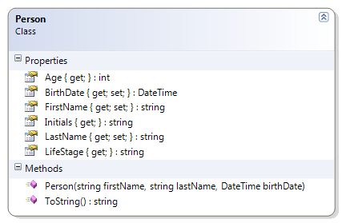
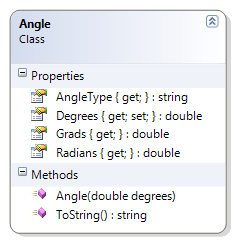
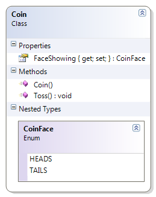

# Assorted Classes

In this solution, we will create an assortment of files just to demonstrate and practice aspects of coding classes in C#. In addition, we will get to practice writing tests.

## Setup

To set up this, from the root of this repo run the following code:

```ps
dotnet new classlib -o src/005/MoreCode -n Assorted
dotnet new sln -o src/005 -n AssortedClasses
```

> Remember to add the `005` folder as one of the workspace folders in VS Code by selecting *File -> Add Folder to Workspace...*

To open this new solution in the Solution Explorer, press <kbd>F1</kbd> and type "Open Solution".

### Person

> Taken from [The Book](https://programming-0101.github.io/TheBook/Topic/F/Examples/Person.html) *(with permission from the author)*

This adaptation of the person class checks the age of the person to see if the person's life stage is infant, toddler, preschooler, school age, or adult.

**Problem Statement**

Write the code that will represent a person with a first and last name and a date of birth. The solution must meet the following requirements (new requirements are in bold):

* Should get and set the first and last name
* Should get the birth date
* Should get the person's approximate age (which is the age that the person will turn to in the current year)
* Should override ToString() to get the person's full name (as first name then last name)
* **Should get the life stage, based on the following table**

Age Range (Years) | Life Stage
------------------|-----------
0                 | Infant
< 3               | Toddler
< 5               | Preschooler
< 18              | School age
>= 18             | Adult

Use the following class diagram when creating your solution. Make the following adaptations:

- [ ] The person should be able to change their name, but not their birthdate.
- [ ] When changing their name, they must provide a non-empty string and the name information must have leading and trailing whitespace removed.



### Angle

> Taken from [The Book](https://programming-0101.github.io/TheBook/Topic/F/Examples/Angle.html) *(with permission from the author)*

This version of the Angle class includes an attribute to identify the type of the angle as either acute, right, obtuse, straight, reflex, full rotation, or undefined. 

**Problem Statement**

Write the code for the Angle class. The solution must meet the following requirements (new requirements are in bold):

* Should `get` and `set` the angle's value (in degrees)
* Should calculate (`get`) the equivalent angle in **Radians** and **Grads**, using the following formulas:
  * $$Radians = Degrees * (\pi / 180)$$
  * $$Grads = Radians * (200 / \pi)$$
* Should override the `ToString()` method to return the angle in degrees, in the following format:
  * degrees °
  * The Unicode character for the degrees symbol (°) is `'\u00B0'`
* Should get the type of angle, based on the following table

    | Angle Range      |  Angle Type |
    | ---------------- | ----------- |
    | < = 0 or > 360   |  Undefined |
    | > 0 and < 90     |  Acute |
    | = 90             |  Right |
    | > 90 and < 180   |  Obtuse |
    | = 180            |  Straight |
    | > 180 and < 360  |  Reflex |
    | = 360            |  Full Rotation |

Use the following class diagram when creating your solution.



### Coin + CoinFace

> Taken from [The Book](https://programming-0101.github.io/TheBook/Topic/I/Examples/Coin.html) *(with permission from the author)*

The CoinFace enumeration helps to describe the two sides of a Coin, which can then be used in a tossing game.

**Problem Statement**

Write the code needed to represent a coin that could be used in a coin-toss game. The solution must meet the following requirements.

* Should randomly generate the coin face that is showing when creating the coin
* Should get the side of the coin that is face showing
* Should allow the coin to be tossed to randomly generate a new coin face
* Should only support two sides for a coin's face: Heads and Tails

Use the following diagram when creating your solution.



## Setting Up for Unit Tests

```ps
# From within the ~/src/005 folder, run the following
dotnet new xunit -o AssortedDemos.Specs
cd AssortedDemos.Specs
dotnet add project ../AssortedDemos/Assorted.csproj
dotnet add package FluentAssertions
```

### Creating a `Fraction` Data Type

> TODO: More Notes....

#### Parsing

We've given our `Fraction` objects the ability to be expressed as a string. Now, let's see if we can *reverse* the process. Taking textual information an producing some other type of object is known as **parsing**.

All of the built-in numeric data types in C# have `static` methods to support converting strings to their numeric values. As a common convention, those methods are called `Parse()` and `TryParse()`. We want our custom numeric data type to do the same, which means we will need to create a `Fraction.Parse()` and `Fraction.TryParse()` pair of methods. Let's begin with our specifications.