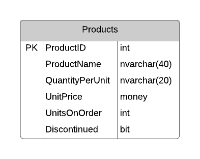
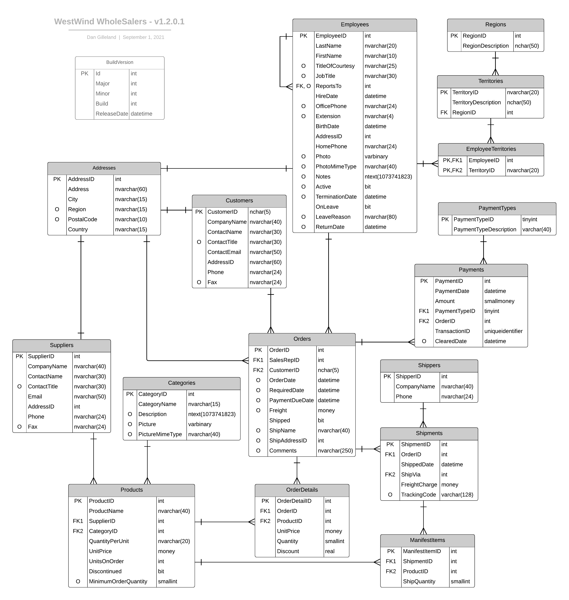

# WestWind - Blazor Version

**WestWind** is my personal adaptation of the original *Northwind Traders* sample database by Microsoft. The [*`.bacpac`* file](./db/WestWind.bacpac) is included in this folder, and [instructions on installing](./db/ReadMe.md) it are included. The [full ERD](#erd) for this database is at the bottom of this page, and the repo can be found on [GitHub](https://github.com/dgilleland/West-Wind-Wholesale).



This demo will walk through the steps involved for creating simple CRUD-like pages to access and modify information in the database.

## Demo Setup

Begin by installing the database from the `WestWind.bacpac` provided. [The instructions are in the `db` folder](./db/ReadMe.md). Test your installation by browsing the database contents.

Create a solution with two projects: a Class Library and an empty Blazor .NET app.

```ps
dotnet new sln -n WWWSystems
dotnet new classlib -n WestWindWholesale -o WWWCore
dotnet new blazor -e -n WebApp -o Website
dotnet sln add WWWCore/WestWindWholesale.csproj
dotnet sln add Website/WebApp.csproj
cd Website
dotnet add reference ../WWWCore/WestWindWholesale.csproj
```

## Connections Strings

Connecting an application to a database is performed through the use of *connection strings*. These are strings that help to identify 1) the location of the database server, 2) the name of the database iteself, and 3) the credentials you need to access the database.

In this course, our database server is SQL Server 2019 (or higher) and the assumption is that you have it installed as the default for your computer. It's also assumed that you have installed the database server to allow the logged-in user access to the server. Given these assumptions, the connection string we would use looks like this:

```
"Server=.;Database=WestWind;Trusted_Connection=True;TrustServerCertificate=True"
```

A connection string is a set of key/value pairs, where each part is separated by commas. Looking at the connection string above, we can deduce the following.

- `Server=.` means that the server is on your local machine as the default instance. If you have it installed as a *named instance*, then you should use that as your value (e.g.: `Server=.\SQLEXPRESS`)
- `Database=WestWind` identifies your database by name.
- `Trusted_Connection=True` means to use the credentials of the currently logged in user (*you*).
- `TrustServerCertificate=True` is used to specify that you are trusting whatever signed certificate is offered by the server.

> There are a wide variety of ways to set up a connection string, depending on your particular database engine. The website [**`ConnectionStrings.com`**](https://www.connectionstrings.com/) is a great resource for exploring how to build your connection strings.

## Entity Framework Core

We will be using *Entity Framework Core* as the foundation on which we perform all our database interactions. Learn more about EF Core in [this article](./db/EFCore.md).

## Reverse Engineering the Database

You can automatically create classes to represent all of the tables in the database, complete with data annotations for validation use. Follow these steps inside of your *class library project*.

1. **Install the necessary tools**: You need to install the EF Core tools by running the following command in your terminal:

```bash
dotnet tool install --global dotnet-ef
```

> ***Note:** You may need to update the tools:
>
> ```bash
> dotnet tool update --global dotnet-ef
> ```

2. **Install the necessary packages**: You need to install the EF Core design and SQL Server packages. Navigate to your project directory and run the following commands:

```bash
dotnet add package Microsoft.EntityFrameworkCore.Design
dotnet add package Microsoft.EntityFrameworkCore.SqlServer
```

3. **Scaffold the DbContext**: Now you can reverse engineer your database. Replace `{connectionString}` with your connection string and `{projectName}` with the name of your project:

```bash
dotnet ef dbcontext scaffold "{connectionString}" Microsoft.EntityFrameworkCore.SqlServer -o {ModelFolder} --context-dir {ContextFolder} --context {projectName}Context --data-annotations
```

> ```bash
> dotnet ef dbcontext scaffold "Server=.;Database=WestWind;Trusted_Connection=True;TrustServerCertificate=True" Microsoft.EntityFrameworkCore.SqlServer -o Models --context-dir DAL --context WestWindContext --data-annotations
> ```

This command creates entity classes and a `DbContext` based on the schema of your existing database. The `-o Models` option puts the generated classes in the Models folder, and `--context-dir Contexts` puts the generated `DbContext` in the Contexts folder.

Remember to replace `{connectionString}` and `{projectName}` with your actual connection string and project name.

----

## ERD


