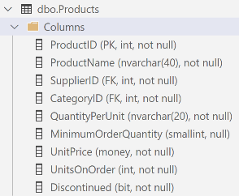

# WestWind Blazor - CRUD

> This material is created as a guide to creating simple CRUD pages for the `Product` table in the *WestWind Wholesale* database. It is presumed that you have [installed the database](../db/ReadMe.md) and followed the [setup instructions](../ReadMe.md) to reverse engineer the database.

The **Products** table contains information on the types of items sold through WestWind Wholesale.



When the database was reverse-engineered, a `Product` class is generated that matches the structure of the database; each `Product` instance is representative of a single rows worth of data in the table.

## Dev Plan

We will create two Blazor pages. The first will display all the products in a tabular format. The second will allow us to add or update a single product in our database. Create two new Blazor components for these pages.

The **`Components/Pages/ProductData/Index.razor`** component should look like this.

```razor
@page "/Product/Index"
@rendermode InteractiveServer
@using WestWindWholesale
@using WestWindWholesale.Models

<PageTitle>Product Catalog</PageTitle>

<h1>Product Catalog</h1>

@code {

}
```

The **`Components/Pages/ProductData/Edit.razor`** component should look like this.

```razor
@page "/Product/Edit"
@rendermode InteractiveServer

@using WestWindWholesale
@using WestWindWholesale.Models

<PageTitle>Product Editor</PageTitle>

<h1>Product Editor</h1>

@code {

}
```

Update your site navigation by adding the following links.

```razor
<li>
    <details class="dropdown">
        <summary><i class="las la-edit"></i> Products</summary>
        <ul dir="ltr">
            <li><a href="/Product/Index"><i class="las la-info"></i> Product Catalog</a></li>
            <li><a href="/Product/Edit"><i class="las la-file-contract"></i> Edit Product</a></li>
        </ul>
    </details>
</li>
```

### Step-by-Step CRUD

The following steps will guide you through all of the work to create a simple CRUD application through these pages.

1. [Backend Setup](./Step-1.md)
1. [Database Read](./Step-2.md)
1. [Database Add](./Step-3.md)
1. [Databaes Update](./Step-4.md)
1. [Database Delete](./Step-5.md)
1. [Filtered Search](./Step-6.md)
1. [Conclusion](./Step-7.md)
