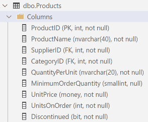

# Database Add

> 
> 

Let's take some observations about the data stored in the Products table. Specifically, note that there are two non-nullable foreign key colums: one for the related Category and one for the related Supplier.



As we allow the users of our Blazor page to enter product information, they will need to supply these foreign key values. But the user should be allowed to choose those values based on *meaningful* information. There are a number of ways to approach this, but we'll take the approach of creating two additional services to get all the available categories and suppliers.

## More BLL Services

Add the following classes to the BLL.

```cs
public class SupplierServices
{
    private readonly WestWindContext _Context;
    internal SupplierServices(WestWindContext context)
    {
        _Context = context;
    }

    public List<Supplier> GetAllSuppliers()
    {
        return _Context.Suppliers.ToList();
    }
}
```

```cs
public class CategoryServices
{
    private readonly WestWindContext _Context;
    internal CategoryServices(WestWindContext context)
    {
        _Context = context;
    }

    public List<Category> GetAllCategories()
    {
        return _Context.Categories.ToList<Category>();
    }
}
```

We must make these services available to the outside world. Modify the `WestWindServices.WWBackendDependencies` method to add the following lines.

```cs
services.AddTransient<CategoryServices>((serviceProvider) =>
{
    var context = serviceProvider.GetService<WestWindContext>();
    return new CategoryServices(context!);
});

services.AddTransient<SupplierServices>((serviceProvider) =>
{
    var context = serviceProvider.GetService<WestWindContext>();
    return new SupplierServices(context!);
});
```

## Support Adding a Product

Adding a product to the database requires us to revisit the `ProductServices` class to add another method.

```cs
public int AddProduct(Product item)
{
    _context.Products.Add(item);
    _context.SaveChanges();
    return item.ProductId;
}
```

## Inject Services Into Your Page

Make the following changes near the top of your `Edit.razor` page to make our BLL services available for use.

```razor
@page "/Product/Edit"
@rendermode InteractiveServer

@using WestWindWholesale
@using WestWindWholesale.Models
@inject ProductServices ProductDbServices
@inject CategoryServices CategoryDbServices
@inject SupplierServices SupplierDbServices

<PageTitle>Product Editor</PageTitle>
```

## Prepare a Form

The first part needed in our page will be to have a `Product` instance available to capture the user's input. Add the following to the `@code { }` block.

```razor
private Product? Product { get; set; }
private List<Category>? Categories { get; set; }
private List<Supplier>? Suppliers { get; set; }
private string UserFeedback;

protected override void OnInitialized()
{
    Product = new();
    Categories = CategoryDbServices.GetAllCategories();
    Suppliers = SupplierDbServices.GetAllSuppliers();
}

private void SaveValidProduct()
{
    // TODO: Save data
    UserFeedback = "TODO: Save Product";
}
```

Next, we will need an `<EditForm>`. Let's start with a minimal working item.

```razor
<EditForm Model="Product" FormName="ProductEditor" OnValidSubmit="SaveValidProduct>
    <label>
        Product Id (Read Only)
        <InputNumber @bind-Value="Product.ProductId" disabled />
    </label>

    <label>
        Product Name
        <InputText @bind-Value="Product.ProductName" />
    </label>

    <button type="submit">Add</button>
</EditForm>
```

If the form looks ok, we'll add a little diagnostics at the bottom of our page.

```razor
<blockquote>
    <h4>Diagnostics</h4>
    <ul>
        <li>User Feedback: @UserFeedback</li>
    </ul>
</blockquote>
```

## Add Validation Annotations to the Product Class

When the database was reverse-engineered, the various entity classes were generated with data annotations related to characteristics of the tables they represent. We can add more annotations that would be helpful in validation within our Blazor form. Make the following additions to `Product.cs` in the class library project.

| Property | Annotation |
|----------|------------|
| `ProductName` | `[Required]` |
| `SupplierId` | `[Range(1, int.MaxValue, ErrorMessage = "Each product must be associated with a supplier")]` |
| `CategoryId` | `[Range(1, int.MaxValue, ErrorMessage = "Each product must be categorized")]` |
| `QuantityPerUnit` | `[Required]` |
| `MinimumOrderQuantity` | `[Range(0, short.MaxValue, ErrorMessage = "Minimun Order Quantity cannot be negative")]` |
| `UnitPrice` | `[Range(typeof(decimal), "0", "100000", ErrorMessage = "Units on Order cannot be negative")]` |
| `UnitsOnOrder` | `[Range(0, int.MaxValue, ErrorMessage = "Units on Order cannot be negative")]` |

## Support Client-Side Validation

To support client-side validation, we add the following above our input controls inside the `<EditForm>`.

```razor
<DataAnnotationsValidator />
<ValidationSummary />
```

Try triggering the validation errors when you click the Add button. One of the things you should notice is that validations errors can be triggered even for properties that aren't yet set up for user input. When the validation occurs for the *model* of the Edit Form, it is applied to *all* the model's properties.

## Complete the Edit Form

It's time finish adding user inputs for the remaining Product information.

```razor
<label>
    Supplier
    <InputSelect @bind-Value="Product.SupplierId">
        <option value="0">[Select a Supplier]</option>
        @foreach(var item in Suppliers)
        {
            <option value="@item.SupplierId">@item.CompanyName</option>
        }
    </InputSelect>
</label>

<label>
    Category
    <InputSelect @bind-Value="Product.CategoryId">
        <option value="0">[Select a Category]</option>
        @foreach(var item in Categories)
        {
            <option value="@item.CategoryId">@item.CategoryName</option>
        }
    </InputSelect>
</label>

<label>
    Quantity Per Unit
    <InputText @bind-Value="Product.QuantityPerUnit" />
</label>

<label>
    Minimum Order Quantity
    <InputNumber @bind-Value="Product.MinimumOrderQuantity" />
</label>

<label>
    Unit Price
    <InputNumber @bind-Value="Product.UnitPrice" />
</label>

<label>
    Units on Order
    <InputNumber @bind-Value="Product.UnitsOnOrder" />
</label>

<label>
    <InputCheckbox @bind-Value="Product.Discontinued" />
    Is Discontinued
</label>
```

## Saving the Data

Now it's time to save the user's input and provide some feedback. We'll also reset the model so that the user can continue on with entering more products.

```cs
    private void SaveValidProduct()
    {
        try
        {
            Id = ProductDbServices.AddProduct(Product!);
            UserFeedback = $"Product details have been added and assigned an Id of {Id}";
            Product = new();
            Id = 0;
        }
        catch(Exception ex)
        {
            UserFeedback = $"Unable to save product information: {ex.Message}";
        }
    }
```

We'll also present the user feedback. Choose what you think is the most appropriate place to put the user feedback message. You might want it closer to where the user clicks the Add button, or you might want it near the top of the form. You might even want to consider some styling to make success and failure conditions more distinct for the user.

The next step in our CRUD app is to support [product updates](./Step-4.md).

> *:octocat: **Commit** your work now. :grey_exclamation:*
