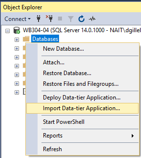
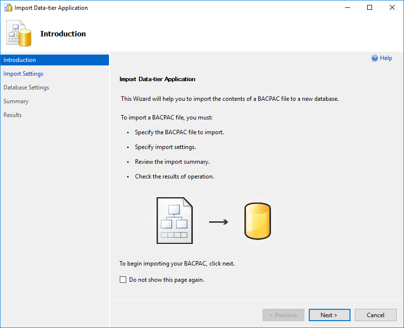
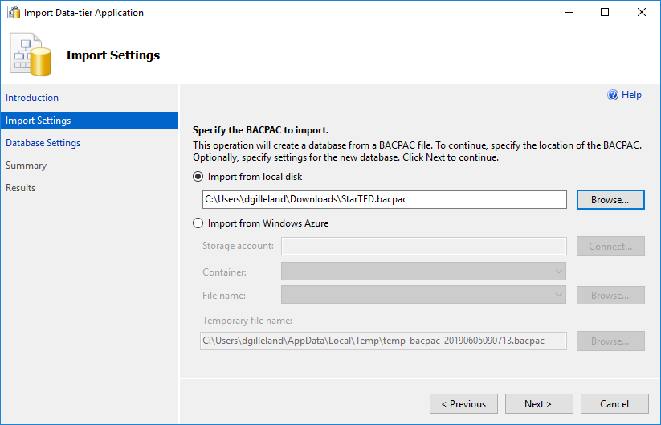
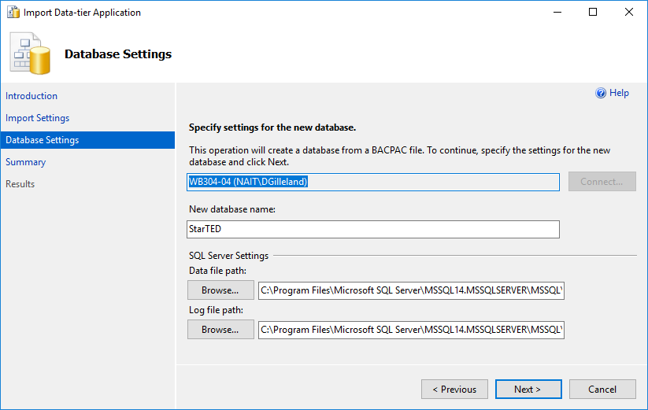
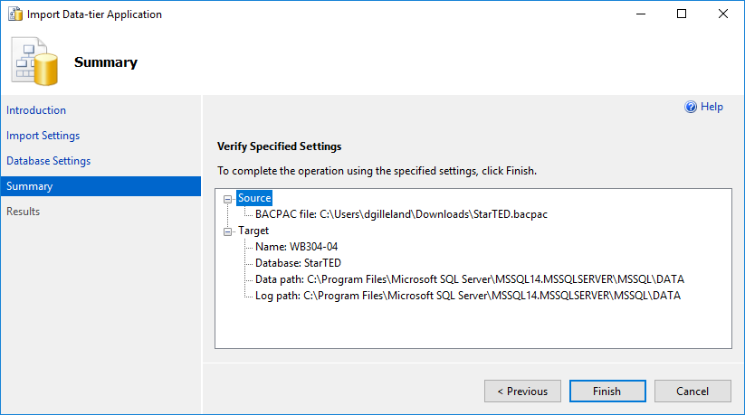
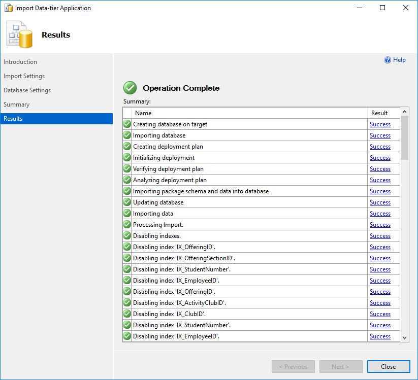
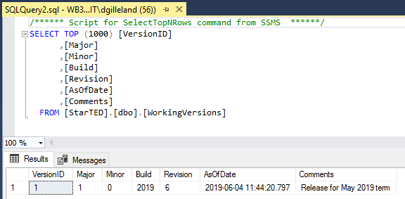
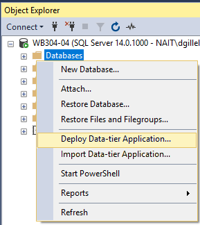

# Installing Databases

Your database(s) will be provided as either *`.bacpac`* or *`.dacpac`* files. These files can be used to create or restore a database on your database server. The process can be completed through *SSMS* or the command line.

## Installing a `*.bacpac`

Open **SSMS** (*Sql Server Management Studio*) and begin by right-clicking on the `Databases` folder and selecting **Import Data-tier Application...**. Follow the steps of the dialog to select your *.bacpac* and install it on your database server.

----

## Installing a `*.dacpac`

Open **SSMS** (*Sql Server Management Studio*) and begin by right-clicking on the `Databases` folder and selecting ***Deploy* Data-tier Application...**. Follow the steps of the dialog to select your *.dacpac* and install it on your database server.

The remaining steps are similar to the ones for the `.bacpac`.
