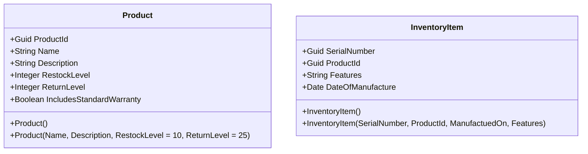

# Simple Inventory System

This represents a simply inventory system for products that each carry serial numbers.

```mermaid
classDiagram
    class Product {
        +Guid ProductId
        +String Name
        +String Description
        +Integer RestockLevel
        +Integer ReturnLevel
        +Boolean IncludesStandardWarranty
        +Product()
        +Product(Name, Description, RestockLevel = 10, ReturnLevel = 25)
    }

    class InventoryItem {
        +Guid SerialNumber
        +Guid ProductId
        +String Features
        +Date DateOfManufacture
        +InventoryItem()
        +InventoryItem(SerialNumber, ProductId, ManufactuedOn, Features)
    }
```