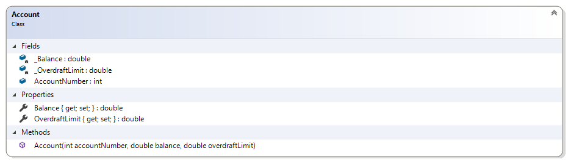

# Banking

The samples shown here represent an evolution of a set of classes that relate to banking.

## Evolution of the Account Class

The simple `Account` class was used to illustrate the concept of encapsulation (private fields with public properties), but with one of the fields being read-only. This necessitates the presence of a constructor. This example includes a driver which shows that an object based on this class is in a "known state" as soon as it is created.



In the accompanying project, the `Account` class and its `DemoDriver` have been provided for you. The code for these classes is as follows.

```csharp
public class Account
{
    public readonly int AccountNumber;
    private double _Balance;
    private double _OverdraftLimit;

    public double Balance
    {
        get { return _Balance; }
        set { _Balance = value; }
    }

    public double OverdraftLimit
    {
        get { return _OverdraftLimit; }
        set { _OverdraftLimit = value; }
    }

    public Account(int accountNumber, double balance, double overdraftLimit)
    {
        AccountNumber = accountNumber;
        Balance = balance;
        OverdraftLimit = overdraftLimit;
    }
}
```

```csharp
public class DemoDriver
{
    public static void Main(string[] args)
    {
        Account savings = new Account(7654321, 100, 200);
        Console.WriteLine($"Account # {savings.AccountNumber} has a balance of ${savings.Balance}");
    }
}
```

----

## Topic D - Debugging

Extra information has been required for the `Account` class. As a result, new properties and an updated constructor is required.

Modify the Account class to include the following additional properties.

```csharp
public string AccountType { get; }
public string BankName { get; }
public int BranchNumber { get; }
public int InstitutionNumber { get; }
```

Then, change the constructor to match the following.

```csharp
public Account(string bankName, int branchNumber, int institutionNumber, int accountNumber, double balance, double overdraftLimit, string accountType)
{
    BankName = bankName;
    BranchNumber = branchNumber;
    InstitutionNumber = institutionNumber;
    AccountNumber = accountNumber;
    Balance = balance;
    OverdraftLimit = overdraftLimit;
    AccountType = accountType;
}
```


> *Note that the modification of the existing constructor introduces a **breaking change**. That is, because the constructor has changed, you will need to modify the Banking's `DemoDriver` class to use the new constructor.*

> TODO: Add an additional driver that will
>
> - [ ] read/write accounts to a JSON file
> - [ ] demonstrate the need for debugging

----

## Topic E – Expressions and Math

This class illustrates simple addition and calculation by allowing deposits and withdrawals. Note that changes to the balance can now only be made through deposits and withdrawals; the setter for the `Balance` must now be set to private.

```csharp
    public double Balance
    {
        get { return _Balance; }
        private set { _Balance = value; }
    }
```

### Problem Statement

Write the code that will represent a simple bank account.

The solution must meet the following requirements (new requirements are in bold):

- Should get the bank name, branch number, institution number, account number, balance, overdraft limit, and account type
- Should allow the overdraft limit to be set
- **Should support deposits and withdrawals**

As such, the following two methods need to be added to the `Account` class.

```csharp
public void Withdraw(double amount)
{
    Balance -= amount;
}

public void Deposit(double amount)
{
    Balance += amount;
}
```


----

## Topic F – If-Else Structures

This class illustrates simple if structure in handling withdrawals; withdrawals are only made when the amount does not exceed the balance and the overdraft. It also identifies if the account is overdrawn.

### Problem Statement

Write the code that will represent a simple bank account. The solution must meet the following requirements (new requirements are in bold):

- Should get the bank name, branch number, institution number, account number, balance, overdraft limit, and account type and allow the overdraft limit to be set
- Should support deposits
- **Should only support withdrawals if the amount does not exceed the sum of the balance and the overdraft limit**
- **Should identify if the account is overdrawn**

The `Withdraw()` function needs rework to ensure that the withdrawal does not cause the account to go beyond the overdraft limit for the account.

```csharp
public double Withdraw(double amount)
{
    if (amount <= Balance + OverdraftLimit)
        Balance = Balance - amount;
    else
        amount = 0;
    return amount;
}
```

In order to simplify the use of `Account` objects in other parts of the program, a boolean property `IsOverdrawn` is being introduced. An account is overdrawn if the balance is less than zero.

```csharp
public bool IsOverdrawn
{
    get
    {
        bool overdrawn;
        if (Balance < 0)
            overdrawn = true;
        else
            overdrawn = false;
        return overdrawn;
    }
}
```


----

## Topic G – Raising Exceptions

The following account information is now verified when the class is created:

1. Bank name and account type cannot be empty
1. The opening balance must be greater than zero
1. The overdraft limit cannot be negative
1. The institution number must be 3 digits
1. The branch number must be 6 digits
1. Attempts to withdraw amounts beyond the overdraft limit should throw an "Insufficient Funds" exception

### Problem Statement

Write the code that will add validation to the Account class. The solution must meet the following requirements (new requirements are in bold):

- Should get the bank name, branch number, institution number, account number, balance, overdraft limit, and account type and allow the overdraft limit to be set
- Should support deposits
- Should only support withdrawals if the amount does not exceed the sum of the balance and the overdraft limit, **otherwise an exception stating "Insufficient Funds" should occur**
- Should identify if the account is overdrawn
- **Should require bank name and account type (that is, they cannot be empty or null)**
- **Should trim the bank name and account type**
- **Should verify that the branch number is six digits and the institution number is three digits**
- **Should require an opening balance**
- **Should not allow a negative overdraft limit**

In order to meet these requirements, the following changes need to be made to the `Account` class.

```csharp
public double Balance
{
    get { return _Balance; }
    private set {
        if (value < -OverdraftLimit)
            throw new Exception("Negative balances cannot exceed the Overdraft Limit");
        _Balance = value;
    }
}

public double OverdraftLimit
{
    get { return _OverdraftLimit; }
    set
    {
        if (value < 0)
            throw new Exception("Negative overdraft limits not allowed");
        _OverdraftLimit = value;
    }
}

public double Withdraw(double amount)
{
    if (amount != Math.Round(amount, 2))
        throw new Exception("Withdrawal amounts cannot include fractions of a penny");
    if (amount > Balance + OverdraftLimit)
        throw new Exception("Insufficient Funds");
    if (amount <= Balance + OverdraftLimit)
        Balance = Math.Round(Balance - amount, 2);
    else
        amount = 0;
    return amount;
}

public void Deposit(double amount)
{
    if (amount != Math.Round(amount, 2))
        throw new Exception("Deposit amounts cannot include fractions of a penny");
    Balance = Math.Round(Balance + amount, 2);
}
```

Also, the constructor needs to be modified to include validation checks related to the initial state of the `Account` objects.

```csharp
// Ensuring a valid state
if (string.IsNullOrEmpty(bankName) || string.IsNullOrEmpty(bankName.Trim()))
    throw new Exception("BankName is required");
if (branchNumber < 10000 || branchNumber > 99999)
    throw new Exception("Branch number must be 5 digits");
if (institutionNumber < 100 || institutionNumber > 999)
    throw new Exception("InstitutionNumber must be a three-digit value");
if (balance <= 0)
    throw new Exception("Opening balance must be greater than zero");
if (balance != Math.Round(balance, 2))
    throw new Exception("Opening balances cannot include a fraction of a penny");
if (overdraftLimit != Math.Round(overdraftLimit, 2))
    throw new Exception("Overdraft limit amounts cannot include a fraction of a penny");
if (string.IsNullOrEmpty(accountType) || string.IsNullOrEmpty(accountType.Trim()))
    throw new Exception("Account type cannot be empty");
```


### Additional Requirements

A flaw has been discovered in the design. As such, the following new requirement has been added.

- **Should only allow positive, non-zero amounts when performing a deposit or withdrawal**

Implement this requirement on your own.

----

## Topic I – Enumerations and Composition

> This topic will reveal how enumerations allow programmers to define new data types and values to represent conceptual information. This topic also discusses the concept of composition, describing how composition is simply the use of objects as fields in a class.

The Account's account type is no longer being represented as a string, but is its own enumeration: AccountType. The solution must meet the following requirements (new requirements are in bold):

- Should get the bank name, branch number, institution number, account number, balance, overdraft limit, and account type and allow the overdraft limit to be set
- Should support deposits
- Should only support withdrawals if the amount does not exceed the sum of the balance and the overdraft limit, otherwise an exception stating "Insufficient Funds" should occur
- Should identify if the account is overdrawn
- Should require bank name and account type (that is, they cannot be empty or null)
- Should trim the bank name
- **Should ensure that the Account Type is type-safe and that it is supplied when creating the account (that is, it cannot be null)**
- **Should support the following types of accounts: Chequing, Saving, Credit Card, and Line of Credit**
- Should verify that the branch number is six digits and the institution number is three digits
- Should require an opening balance
- Should not allow a negative overdraft limit

### Constraining the `AccountType` Data

One of the characteristics that has risen from using a `string` as the data type for the `AccountType` field of the `Account` class is that it's too easy to accidentally introduce "bad" data. This could happen through typos in the string values (e.g.: `"Debet"` instead of `"Debit"`) or outright bad data (e.g.: `"Laundered Income"`).

A more controlled way to ensure the correct value is to introduce an enumeration with a closed set of values.

```csharp
public enum AccountType
{
    CHEQUING,
    SAVINGS,
    CREDIT_CARD,
    LINE_OF_CREDIT
}
```


Then, we can introduce a private read-only field for this data along with an overloaded constructor that uses the `AccountType` instead of a string.


What we don't want to do, however, is introduce *breaking changes*. A breaking change is when we *remove* or *modify* an existing `public` characteristic of our class. In this case, that means we will still keep the public getter `AccountType` as a string, and we will keep the original constructor. Our new private read-only field and new constructor will *extend* our class' functionality without *breaking* it.

First of all, will introduce the new read-only field as a private member with a different name.

```csharp
private readonly AccountType _AccountType;
```

Next, we will create our new constructor with the `AccountType` data type for the `accountType` parameter. In the process, we will also *move* all of the code from the original constructor to this new constructor.

```csharp
public Account(string bankName, int branchNumber, int institutionNumber, int accountNumber, double balance, double overdraftLimit, AccountType accountType)
{
    // Move code from original constructor to this constructor.
}
```

That will leave us with a couple of compiler errors. We will have to **remove** the following lines from the new constructor.

```csharp
if (string.IsNullOrEmpty(accountType) || string.IsNullOrEmpty(accountType.Trim()))
    throw new Exception("Account type cannot be empty");
// ...
AccountType = accountType;
```

Then we will add in the assignment of the `accountType` to the new read-only property.

```csharp
_AccountType = accountType;
```

To reduce the presence of duplicate code, we will "chain" the old constructor to the new constructor using the `this` keyword right after the parameter list. That is, if our old constructor is called, we will simply pass the parameter values to the new constructor. In the case of the final `accountType` parameter, we will have to first parse the string value as our enumerated value as follows : `(AccountType)Enum.Parse(typeof(AccountType), accountType)`

```csharp
public Account(string bankName, int branchNumber, int institutionNumber, int accountNumber, double balance, double overdraftLimit, string accountType)
    : this(bankName, branchNumber, institutionNumber, accountNumber, balance, overdraftLimit, (AccountType)Enum.Parse(typeof(AccountType)))
{
    // This old constructor's body is now empty
}
```

If someone tries using the old constructor with valid values, everything will be fine. But if they send in invalid values, then a parsing exception will occur to let them know about the error.

Lastly, we would re-write the `AccountType` property to return the string representation of the read-only property.

```csharp
public string AccountType { get { return _AccountType.ToString(); } }
```

> #### Introducing Humanizer
>
> While enumerations provide a controlled programmatic way to ensure a closed set of values, they often don't translate to strings in a nice human-readable way. That's where a popular 3rd-party library comes in handy. [Humanizer](https://humanizr.net/) is a free-to-use NuGet package that provides amazing string manipulation methods right out of the box. It's perfect for, among other things, dealing with enumerations.
>
> First, add a reference to Humanizer to your project: `dotnet add package Humanizer.Core`. Next, add a `using` statement to include the `Humanizer` namespace.
>
> Then, modify your `AccountType` property to return a clean, human-readable value for the `_AccountType` enumerated field.
>
> ```csharp
> public string AccountType { get { return _AccountType.Humanize(); }}
> ```
>
> We can even use it in our old constructor to convert the string input into it enumerated value. Replace the portion that says `(AccountType)Enum.Parse(typeof(AccountType), accountType)` with `accountType.DehumanizeTo<AccountType>()` to accomplish the same thing, but also allowing for a human-readable string as input.

### Additional Data Types and Composition

Typically, for every bank account, there are **bank statements**. Here, we will introduce two new data types demonstrating both enumerations and composition.

First, the `Month` enumeration is needed to constrain the allowable month names. An additional possible value - `NotSpecified` - is present to represent the absence of month information. This is a practice sometimes used for enumerations as a way to allow for the notion of an "absent" value, since enumerations are by definition Value Types. It also has the nice side benefit, in our case, of automatically allowing the first month `January` to have the underlying integer value of `1`.


```csharp
public enum Month { NotSpecified, January, February, March, April, May, June, July, August, September, October, November, December }
```

Next, the `BankStatement` class describes important information on a monthly summary for the `Account`.


The code for the BankStatement class looks as follows.

```csharp
public class BankStatement
{
    public readonly Month Month;
    public Account BankAccount{ get; private set; }
    public double EndingBalance { get; }
    public double StartingBalance { get; }
    public int TotalDeposits{ get; }
    public int TotalWithdrawals{ get; }

    public BankStatement(Account bankAccount, Month month)
    {
        BankAccount = bankAccount ?? throw new ArgumentNullException("Cannot have a BankStatement without a BankAccount");
        Month = month != Month.NotSpecified ? month : throw new ArgumentException("A valid month is required");
    }
}
```

> **Bonus:** Notice that the constructor makes use of the *Null-Coalescing Operator* `??` to both assign and validate the supplied bank account. Also, a *Ternary Expression* `? :` is used to assign and validate the supplied month.

----

## Topic K - Looping and Collections

Here we introduce additional classes to represent a bank statement for a bank account for a given month. The `BankStatement` allows `BankTransaction` objects to be added, and performs deposits and withdrawals on the `BankAccount`. The statement reports the starting and ending balance and also summarizes the total amount deposited and withdrawn for the month. The following methods must be coded to complete the solution.

### The `BankTransaction` Record


> ***New** in C#9* - The `record` keyword allows for the quick creation of an **immutable** class. It is the perfect choice for our `BankTransaction` because the transaction information should never change.

```csharp
    public record BankTransaction(double Amount, DateTime Date, string FromAccount, string ToAccount, string Description);
```

### `Account` Overrides `ToString()`

In order to simplify the comparison of `Account` objects to the `FromAccount` and `ToAccount` in the `BankTransaction`, we can override the `ToString()` method of the `Account` class to represent the full account number in this format.

```csharp
public override string ToString()
{
    return $"{InstitutionNumber}-{BranchNumber}-{AccountNumber}";
}
```


### `BankStatement` Modifications

With the new `BankTransaction`, we can maintain a list of these objects in our `BankStatement`. Further, in order to properly apply the transaction to the `BankAccount`, we will include an `Add()` method that will determine if the amount should be applied as a deposit or a withdrawal.


----

## Topic L - Arrays - Not Sorted

Create a test driver called `DemoArrays` with a static `Main(string[] args)` method that makes use of the following two methods to load and filter an array of transactions. Apply this information to also generate a `BankStatement`.

```csharp
public BankTransaction[] LoadTransactions()
{
    BankTransaction[] transactions = 
    {
        new BankTransaction(1200.00, new DateTime(2021, 5, 1), "123-123456-7654321", "247-125556-6543218", "Midtown Apartment Rentals"),
        new BankTransaction(8.95, new DateTime(2021, 5, 5), "123-123456-7654321", "123-123456-7654321", "McDonald's Purchase"),
        new BankTransaction(82.96, new DateTime(2021, 5, 7), "123-123456-7654321", "231-425361-9284720", "Esso Gas"),
        new BankTransaction(4.75, new DateTime(2021, 5, 7), "123-123456-7654321", "123-123456-7654321", "McDonald's Purchase"),
        new BankTransaction(88.32, new DateTime(2021, 5, 8), "123-123456-7654321", "123-443456-7654321", "Canadian Superstore Purchase"),
        new BankTransaction(4.95, new DateTime(2021, 5, 10), "123-123456-7654321", "123-443456-7654321", "Canadian Superstore Purchase"),
        new BankTransaction(88.60, new DateTime(2021, 5, 12), "123-123456-7654321", "123-987543-3957211", "Staples"),
        new BankTransaction(11.30, new DateTime(2021, 5, 12), "123-123456-7654321", "123-123456-7654321", "McDonald's Purchase"),
        new BankTransaction(1394.55, new DateTime(2021, 5, 14), "111-823456-9632587", "123-123456-7654321", "Sports Check Deposit"),
        new BankTransaction(103.24, new DateTime(2021, 5, 16), "123-123456-7654321", "123-443456-7654321", "Canadian Superstore Purchase"),
        new BankTransaction(9.50, new DateTime(2021, 5, 17), "123-123456-7654321", "123-123456-7654321", "McDonald's Purchase"),
        new BankTransaction(17.70, new DateTime(2021, 5, 18), "123-123456-7654321", "123-443456-7654321", "Canadian Superstore Purchase"),
        new BankTransaction(57.22, new DateTime(2021, 5, 18), "123-123456-7654321", "123-443456-7654321", "Canadian Superstore Purchase"),
        new BankTransaction(75.44, new DateTime(2021, 5, 19), "123-123456-7654321", "231-425361-9284720", "Esso Gas"),
        new BankTransaction(120.40, new DateTime(2021, 5, 20), "123-123456-7654321", "123-987543-3957211", "Staples"),
        new BankTransaction(22.40, new DateTime(2021, 5, 24), "123-123456-7654321", "123-443456-7654321", "Canadian Superstore Purchase"),
        new BankTransaction(82.18, new DateTime(2021, 5, 27), "123-123456-7654321", "123-223456-9835123", "Home Depot"),
        new BankTransaction(1394.55, new DateTime(2021, 5, 28), "111-823456-9632587", "123-123456-7654321", "Sports Check Deposit"),
        new BankTransaction(103.24, new DateTime(2021, 5, 28), "123-123456-7654321", "123-443456-7654321", "Canadian Superstore Purchase"),
        new BankTransaction(250.00, new DateTime(2021, 5, 29), "123-123456-7654321", "103-123937-7107321", "Epcore"),
        new BankTransaction(320.00, new DateTime(2021, 5, 30), "123-123456-7654321", "342-155456-1387421", "Als Auto Repair"),
        new BankTransaction(18.99, new DateTime(2021, 5, 30), "123-123456-7654321", "123-443456-7654321", "Canadian Superstore Purchase"),
        new BankTransaction(85.50, new DateTime(2021, 5, 31), "123-123456-7654321", "333-029456-7852365", "Rogers Internet")
    };
    return transactions;
}
```

```csharp
public BankTransaction[] FindDeposits(BankTransaction[] transactions, string account)
{
    int logicalSize = 0;
    BankTransaction[] found = new BankTransaction[transactions.Length]; // Allow for max found

    for(int index = 0; index < transactions.Length; index ++)
    {
        if(transactions[index].ToAccount == account)
        {
            found[logicalSize] = transactions[index];
            logicalSize++;
        }
    }

    BankTransaction[] trimmed = new BankTransaction[logicalSize];
    for(int index = 0; index < logicalSize; index ++)
        trimmed[index] = found[index];

    return trimmed;
}
```

----

## Topic M - Arrays - Sorted

Extend your driver from the previous topic. Create a Bubble Sort algorithm to sort the results of the `LoadTransactions()` by the description.


----

## Topic N - Modularization and Utility Classes

> TODO:
>
> - [ ] Modularize the Driver because it's growing in size
> - [ ] Modularize the user Input/Output
> - [ ] Generalize the Bubble Sort or other items (such as the **Swap**, using a Generic Method!)

----

## Topic O - File I/O

> TODO:
>
> - [ ] File I/O of `BankTransaction`
