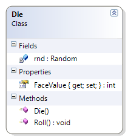
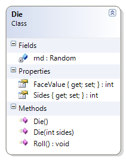
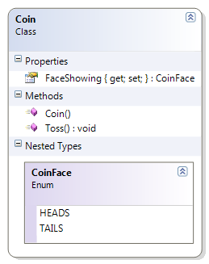
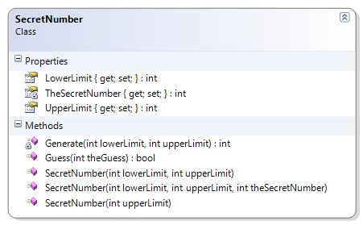
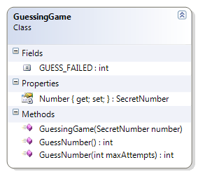
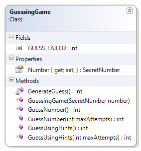
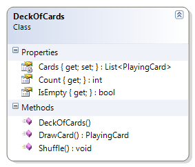
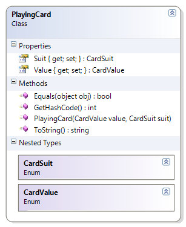
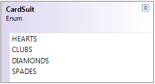
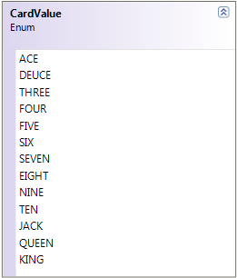

# Gaming

The samples shown here represent an evolution of a set of classes that can be useful in gaming.

## Topic E – Expressions and Math

The `Die` class represents a single six-sided die. This example is used to illustrate random number generation. Write the code for the Die class. The solution must meet the following requirements:

- Should Randomly Generate FaceValue Between 1 And 6 From Constructor
- Should Randomly Generate FaceValue Between 1 And 6 When Rolling

Use the following class diagram when creating your solution. Note that this uses the Random class from the `System` namespace as a private static field.



```csharp
public class Die
{
    private static Random rnd = new Random();

    public Die()
    {
        Roll();
    }

    public int FaceValue { get; private set; }

    public void Roll()
    {
        FaceValue = rnd.Next(1, 7);
    }
}
```

### A Multi-Sided Die

Expand on the original Die class to allow for creating a die of any number of sides, with a default of six sides. Accomplish this with an overloaded constructor. The solution must meet the following requirements:

- The Sides and FaceValue properties' `set` should be private.
- Should generate a six-sided die by default
- Should get the number of sides of the die
- Should randomly generate each side (if rolled enough); for example, if the die has ten sides, it should eventually roll a 1, 2, 3, 4, 5 6, 7, 8, 9, and 10

Use the following class diagram when creating your solution.


----

## Topic G - Raising Exceptions

Here we want to add some validation on the multi-sided die to only acceps between 4 and 20 sides for a die. The solution must meet the following requirements (new requirements are in **bold**):

- Should generate a random value from 1 to the number of sides on the die, when initially created and when re-rolled
- Should get the face value of the die
- Should get the number of sides of the die
- Should randomly generate each side (if rolled enough); for example, if the die has ten sides, it should eventually roll a 1, 2, 3, 4, 5 6, 7, 8, 9, and 10
- **Should only accept 4 to 20 sides for the die**

Use the following class diagram when creating your solution.


 
```csharp
public Die(int sides)
{
    if (sides < 4 || sides > 20)
        throw new System.Exception("A die can only have from 4 to 20 sides");
    this.Sides = sides;
    Roll();
}
```

----

## Topic I – Enumerations and Composition

The `CoinFace` enumeration helps to describe the two sides of a `Coin`, which can then be used in a tossing game. Write the code needed to represent a coin that could be used in a coin-toss game. The solution must meet the following requirements.

- Should randomly generate the coin face that is showing when creating the coin
- Should get the side of the coin that is face showing
- Should allow the coin to be tossed to randomly generate a new coin face
- Should only support two sides for a coin's face: Heads and Tails

Use the following diagram when creating your solution.



```csharp
public class Coin
{
    public enum CoinFace { HEADS, TAILS };

    public CoinFace FaceShowing { get; private set; }

    public Coin()
    {
        Toss();
    }

    public void Toss()
    {
        if (Rnd.Next(2) == 0)
            FaceShowing = CoinFace.HEADS;
        else
            FaceShowing = CoinFace.TAILS;
    }
}
```

## Topic J - Looping Structures

The `GuessingGame` example uses a class called `SecretNumber` which picks a random whole number between a specific range. An instance of the SecretNumber is passed to the constructor of the GuessingGame, and the GuessingGame's `Guess()` method attempts to get the correct guess within a specified number of tries.

In a regular number guessing game between two people, one person asks another person to guess a whole number between a pair of values. In this example, two different classes take on the roles of the two people in the game: The `SecretNumber` class takes on the role of the person who has picked a value between some lower and upper limit, while the `GuessingGame` class takes on the role of the person who has to guess what that hidden number is.

### `SecretNumber` Class

Objects of this class will store a hidden value between some upper and lower limit (inclusive). The SecretNumber class supports three public methods:

- **GetLowerLimit()** – Returns a number representing the lower end (inclusive) of the range of possible values for the hidden value.
- **GetUpperLimit()** – Returns a number representing the upper end (inclusive) of the range of possible values for the hidden value.
- **Guess()** – Returns true if the supplied value matches the hidden value, otherwise it returns false.



```csharp
public class SecretNumber
{
    private static Random _rnd = new Random();
    public readonly int LowerLimit;
    public readonly int UpperLimit;
    private readonly int TheSecretNumber;

    public SecretNumber(int upperLimit) : this(1, upperLimit)
    { }
    public SecretNumber(int lowerLimit, int upperLimit) : this(lowerLimit, upperLimit, _rnd.Next(lowerLimit, upperLimit + 1))
    { }
    public SecretNumber(int lowerLimit, int upperLimit, int theSecretNumber)
    {
        LowerLimit = lowerLimit;
        UpperLimit = upperLimit;
        TheSecretNumber = theSecretNumber;
    }

    public bool Guess(int myBestGuess)
    {
        return TheSecretNumber == myBestGuess;
    }
}
```
 
### `GuessingGame` Class

This class simulates the action of guessing what hidden value is stored inside of a SecretNumber object. The SecretNumber is supplied to the constructor of the GuessingGame, and the following methods attempt to find out what that number is.

- **GuessNumber()** – This first method simply tries to guess the hidden value of the SecretNumber. It has "unlimited" guesses, and it will return the number of attempts it took to find out what that hidden number is.
- **GuessNumber(MaxAttempts : Integer)** – This method will also try to guess the SecretNumber's hidden value, but it is limited to a maximum number of guesses. This method will return the actual number of attempts it took to find the hidden value, or it will return the `GUESS_FAILED` constant if it was unable to guess the secret number.

Try creating alternate versions of this GuessingGame that will use a while statement and a for statement in the GuessNumber methods.


 
```csharp
public class GuessingGame
{
    private SecretNumber Number { get; set; }
    public const int GUESS_FAILED = -1;

    public GuessingGame(SecretNumber number)
    {
        if (number == null)
            throw new System.Exception("SecretNumber cannot be null");
        this.Number = number;
    }

    public int GuessNumber(int maxAttempts)
    {
        int numberOfAttempts = 0;
        bool correct = false;
        while (maxAttempts > 0 && !correct)
        {
            // Make a guess
            int myBestGuess = Rnd.Next(Number.LowerLimit, Number.UpperLimit);
            if (Number.Guess(myBestGuess))
                correct = true;
            numberOfAttempts++;
            maxAttempts--;
        }
        if (!correct)
            numberOfAttempts = GUESS_FAILED; // a "flag" to say the guess was incorrect
        return numberOfAttempts;
    }

    public int GuessNumber()
    {
        bool correct = false;
        int numberOfAttempts = 0;
        while (numberOfAttempts < int.MaxValue && !correct)
        {
            // Make a guess
            int myBestGuess = Rnd.Next(Number.LowerLimit, Number.UpperLimit);
            if (Number.Guess(myBestGuess))
                correct = true;
            numberOfAttempts++;
        }
        if (!correct)
            numberOfAttempts = GUESS_FAILED;
        return numberOfAttempts;
    }
}
```

### Improving the `GuessingGame` and `SecretNumber`

Expand on the sample GuessingGame by adding more guess methods to make guessing more efficient by using the SecretNumber's `GuessWithHint()` method.

First, modify the `SecretNumber` class by adding a method to guess with a hint.


```csharp
public enum Hint{ CORRECT, GUESS_HIGHER, GUESS_LOWER}

public Hint GuessWithHint(int myBestGuess)
{
    return TheSecretNumber == myBestGuess ? Hint.CORRECT 
         : TheSecretNumber < myBestGuess ? Hint:GUESS_HIGHER : Hint.GUESS_LOWER;
}
```

Next, modify the `GuessingGame` class to allow playing the game with hints. Add the following methods.



- **GuessUsingHints()** – This first method simply tries to guess the hidden value of the SecretNumber. It has "unlimited" guesses, and it will return the number of attempts it took to find out what that hidden number is. Use the GuessWithHint method of the SecretNumber object.
* **GuessUsingHints(MaxAttempts : Integer)** – This method will also try to guess the SecretNumber's hidden value, but it is limited to a maximum number of guesses. This method will return the actual number of attempts it took to find the hidden value, or it will return the `GUESS_FAILED` constant if it was unable to guess the secret number. Use the GuessWithHint method of the SecretNumber object.
As an additional exercise, create a simple driver that instantiates a SecretNumber object and supplies it to a GuessingGame object. Show how many attempts it took to guess the hidden number when using hints.

----

## Topic K - Looping and Collections

### Deal Me In!

The notion of a card game is another excellent example of using **composition** with classes and enumerations. It also provides us with an opportunity to do some looping logic with a generic list `List<T>`. Finally, we'll sneak in the [**Lambda Operator**](https://docs.microsoft.com/dotnet/csharp/language-reference/operators/lambda-operator) for some property getters.

| DeckOfCards | PlayingCard | CardSuit | CardValue |
|---|---|---|---|
|  |  |  |  |

```csharp
public class PlayingCard
{
    public CardSuit Suit { get; private set; }
    public CardValue Value { get; private set; }
    public PlayingCard(CardValue value, CardSuit suit)
    {
        Value = value;
        Suit = suit;
    }
    public override string ToString()
    {
        return $"{Value} {Suit}";
    }
}
```

```csharp
public enum CardSuit
{
    HEARTS = 1,
    CLUBS,
    DIAMONDS,
    SPADES
}
```

```csharp
public enum CardValue
{
    ACE = 1,
    DEUCE,
    THREE,
    FOUR,
    FIVE,
    SIX,
    SEVEN,
    EIGHT,
    NINE,
    TEN,
    JACK,
    QUEEN,
    KING
}
```

```csharp
public class DeckOfCards
{
    private static Random Rnd = new Random();
    public List<PlayingCard> Cards { get; private set; }
    public int Count => Cards.Count;
    public bool IsEmpty => Cards.Count == 0;
    public DeckOfCards()
    {
        Cards = new List<PlayingCard>();
        var allSuits = System.Enum.GetValues(typeof(PlayingCard.CardSuit));
        var allValues = System.Enum.GetValues(typeof(PlayingCard.CardValue));
        foreach (PlayingCard.CardSuit suit in allSuits)
            foreach (PlayingCard.CardValue value in allValues)
                Cards.Add(new PlayingCard(value, suit));
    }

    public PlayingCard DrawCard()
    {
        PlayingCard card = null;
        if (Cards.Count != 0)
        {
            card = Cards[0];
            Cards.Remove(card);
        }
        return card;
    }
    public void Shuffle()
    {
        for (int counter = 0; counter < 100; counter++)
        {
            int index = Rnd.Next(Cards.Count);
            PlayingCard card = Cards[0];
            Cards.RemoveAt(0);
            Cards.Insert(index, card);
        }
    }
}
```
